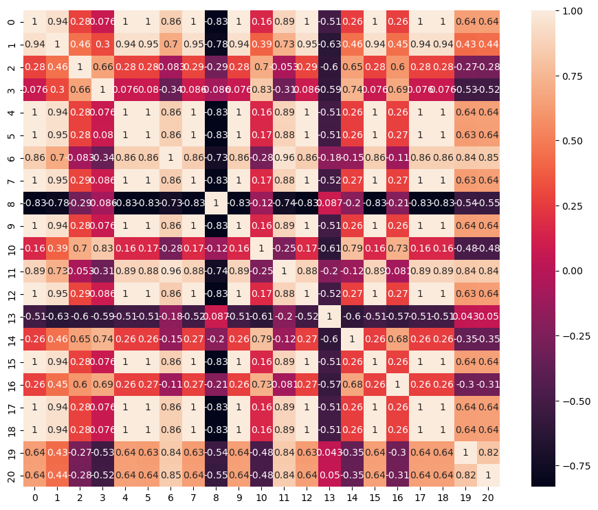

```python
# Importing libraries

import pandas as pd 
import numpy as np
import matplotlib.pyplot as plt
import seaborn as sns
from scipy.stats import mode
from sklearn.model_selection import train_test_split as split
from sklearn.preprocessing import MinMaxScaler
from sklearn.linear_model import LogisticRegression as LR
from sklearn import preprocessing
```


```python
# Load data into dataframe

url = 'sensor_condición.xlsx'

df_sensors = pd.read_excel(url)
df_sensors.head()
```


<div>
<style scoped>
    .dataframe tbody tr th:only-of-type {
        vertical-align: middle;
    }

    .dataframe tbody tr th {
        vertical-align: top;
    }

    .dataframe thead th {
        text-align: right;
    }
</style>
<table border="1" class="dataframe">
  <thead>
    <tr style="text-align: right;">
      <th></th>
      <th>Activo_id</th>
      <th>ciclo</th>
      <th>s1</th>
      <th>s2</th>
      <th>s3</th>
      <th>s4</th>
      <th>s5</th>
      <th>s6</th>
      <th>s7</th>
      <th>s8</th>
      <th>...</th>
      <th>s13</th>
      <th>s14</th>
      <th>s15</th>
      <th>s16</th>
      <th>s17</th>
      <th>s18</th>
      <th>s19</th>
      <th>s20</th>
      <th>s21</th>
      <th>condicion</th>
    </tr>
  </thead>
  <tbody>
    <tr>
      <th>0</th>
      <td>1</td>
      <td>1</td>
      <td>518.67</td>
      <td>641.82</td>
      <td>1589.70</td>
      <td>1400.60</td>
      <td>14.62</td>
      <td>21.61</td>
      <td>554.36</td>
      <td>2388.06</td>
      <td>...</td>
      <td>2388.02</td>
      <td>8138.62</td>
      <td>8.4195</td>
      <td>0.03</td>
      <td>392</td>
      <td>2388</td>
      <td>100</td>
      <td>39.06</td>
      <td>23.4190</td>
      <td>0</td>
    </tr>
    <tr>
      <th>1</th>
      <td>1</td>
      <td>2</td>
      <td>518.67</td>
      <td>642.15</td>
      <td>1591.82</td>
      <td>1403.14</td>
      <td>14.62</td>
      <td>21.61</td>
      <td>553.75</td>
      <td>2388.04</td>
      <td>...</td>
      <td>2388.07</td>
      <td>8131.49</td>
      <td>8.4318</td>
      <td>0.03</td>
      <td>392</td>
      <td>2388</td>
      <td>100</td>
      <td>39.00</td>
      <td>23.4236</td>
      <td>0</td>
    </tr>
    <tr>
      <th>2</th>
      <td>1</td>
      <td>3</td>
      <td>518.67</td>
      <td>642.35</td>
      <td>1587.99</td>
      <td>1404.20</td>
      <td>14.62</td>
      <td>21.61</td>
      <td>554.26</td>
      <td>2388.08</td>
      <td>...</td>
      <td>2388.03</td>
      <td>8133.23</td>
      <td>8.4178</td>
      <td>0.03</td>
      <td>390</td>
      <td>2388</td>
      <td>100</td>
      <td>38.95</td>
      <td>23.3442</td>
      <td>0</td>
    </tr>
    <tr>
      <th>3</th>
      <td>1</td>
      <td>4</td>
      <td>518.67</td>
      <td>642.35</td>
      <td>1582.79</td>
      <td>1401.87</td>
      <td>14.62</td>
      <td>21.61</td>
      <td>554.45</td>
      <td>2388.11</td>
      <td>...</td>
      <td>2388.08</td>
      <td>8133.83</td>
      <td>8.3682</td>
      <td>0.03</td>
      <td>392</td>
      <td>2388</td>
      <td>100</td>
      <td>38.88</td>
      <td>23.3739</td>
      <td>0</td>
    </tr>
    <tr>
      <th>4</th>
      <td>1</td>
      <td>5</td>
      <td>518.67</td>
      <td>642.37</td>
      <td>1582.85</td>
      <td>1406.22</td>
      <td>14.62</td>
      <td>21.61</td>
      <td>554.00</td>
      <td>2388.06</td>
      <td>...</td>
      <td>2388.04</td>
      <td>8133.80</td>
      <td>8.4294</td>
      <td>0.03</td>
      <td>393</td>
      <td>2388</td>
      <td>100</td>
      <td>38.90</td>
      <td>23.4044</td>
      <td>0</td>
    </tr>
  </tbody>
</table>
<p>5 rows × 24 columns</p>
</div>


```python
# Validamos que valores puede tomar la variable dependiente **condicion**

df_sensors.condicion.unique()
```


    array([0, 1])


## Pregunta Nº 1 

> Realizar un modelo de regresión logística con la data sensor condicion.xlsx utilizar las variable condicion como target, y s1 hasta s21 como predictoras


```python
varX = df_sensors.iloc[:,2:-1].values
varY = df_sensors.iloc[:,-1].values

pd.DataFrame(varX).head()
```


<div>
<style scoped>
    .dataframe tbody tr th:only-of-type {
        vertical-align: middle;
    }

    .dataframe tbody tr th {
        vertical-align: top;
    }

    .dataframe thead th {
        text-align: right;
    }
</style>
<table border="1" class="dataframe">
  <thead>
    <tr style="text-align: right;">
      <th></th>
      <th>0</th>
      <th>1</th>
      <th>2</th>
      <th>3</th>
      <th>4</th>
      <th>5</th>
      <th>6</th>
      <th>7</th>
      <th>8</th>
      <th>9</th>
      <th>...</th>
      <th>11</th>
      <th>12</th>
      <th>13</th>
      <th>14</th>
      <th>15</th>
      <th>16</th>
      <th>17</th>
      <th>18</th>
      <th>19</th>
      <th>20</th>
    </tr>
  </thead>
  <tbody>
    <tr>
      <th>0</th>
      <td>518.67</td>
      <td>641.82</td>
      <td>1589.70</td>
      <td>1400.60</td>
      <td>14.62</td>
      <td>21.61</td>
      <td>554.36</td>
      <td>2388.06</td>
      <td>9046.19</td>
      <td>1.3</td>
      <td>...</td>
      <td>521.66</td>
      <td>2388.02</td>
      <td>8138.62</td>
      <td>8.4195</td>
      <td>0.03</td>
      <td>392.0</td>
      <td>2388.0</td>
      <td>100.0</td>
      <td>39.06</td>
      <td>23.4190</td>
    </tr>
    <tr>
      <th>1</th>
      <td>518.67</td>
      <td>642.15</td>
      <td>1591.82</td>
      <td>1403.14</td>
      <td>14.62</td>
      <td>21.61</td>
      <td>553.75</td>
      <td>2388.04</td>
      <td>9044.07</td>
      <td>1.3</td>
      <td>...</td>
      <td>522.28</td>
      <td>2388.07</td>
      <td>8131.49</td>
      <td>8.4318</td>
      <td>0.03</td>
      <td>392.0</td>
      <td>2388.0</td>
      <td>100.0</td>
      <td>39.00</td>
      <td>23.4236</td>
    </tr>
    <tr>
      <th>2</th>
      <td>518.67</td>
      <td>642.35</td>
      <td>1587.99</td>
      <td>1404.20</td>
      <td>14.62</td>
      <td>21.61</td>
      <td>554.26</td>
      <td>2388.08</td>
      <td>9052.94</td>
      <td>1.3</td>
      <td>...</td>
      <td>522.42</td>
      <td>2388.03</td>
      <td>8133.23</td>
      <td>8.4178</td>
      <td>0.03</td>
      <td>390.0</td>
      <td>2388.0</td>
      <td>100.0</td>
      <td>38.95</td>
      <td>23.3442</td>
    </tr>
    <tr>
      <th>3</th>
      <td>518.67</td>
      <td>642.35</td>
      <td>1582.79</td>
      <td>1401.87</td>
      <td>14.62</td>
      <td>21.61</td>
      <td>554.45</td>
      <td>2388.11</td>
      <td>9049.48</td>
      <td>1.3</td>
      <td>...</td>
      <td>522.86</td>
      <td>2388.08</td>
      <td>8133.83</td>
      <td>8.3682</td>
      <td>0.03</td>
      <td>392.0</td>
      <td>2388.0</td>
      <td>100.0</td>
      <td>38.88</td>
      <td>23.3739</td>
    </tr>
    <tr>
      <th>4</th>
      <td>518.67</td>
      <td>642.37</td>
      <td>1582.85</td>
      <td>1406.22</td>
      <td>14.62</td>
      <td>21.61</td>
      <td>554.00</td>
      <td>2388.06</td>
      <td>9055.15</td>
      <td>1.3</td>
      <td>...</td>
      <td>522.19</td>
      <td>2388.04</td>
      <td>8133.80</td>
      <td>8.4294</td>
      <td>0.03</td>
      <td>393.0</td>
      <td>2388.0</td>
      <td>100.0</td>
      <td>38.90</td>
      <td>23.4044</td>
    </tr>
  </tbody>
</table>
<p>5 rows × 21 columns</p>
</div>


```python
X_train, X_test, y_train, y_test = split(varX, varY, test_size = 0.2, random_state=0)
print(X_train.shape,X_test.shape)
```

    (3334, 21) (834, 21)


```python
# Escalar los valores predictores

escaler = MinMaxScaler()
X_train = escaler.fit_transform(X_train.astype('float64'))
X_test  = escaler.transform(X_test.astype('float64'))

X_test[:5,:]
```


    array([[0.        , 0.40247678, 0.54203852, 0.63639922, 0.        ,
            1.        , 0.42806394, 0.36206897, 0.26143191, 0.        ,
            0.58      , 0.46335697, 0.33823529, 0.2820373 , 0.61978947,
            0.        , 0.4       , 0.        , 0.        , 0.36220472,
            0.22620669],
           [0.        , 0.29102167, 0.13644904, 0.14344423, 0.        ,
            1.        , 0.70870337, 0.12068966, 0.18781819, 0.        ,
            0.2       , 0.77777778, 0.16176471, 0.17286509, 0.48757895,
            0.        , 0.3       , 0.        , 0.        , 0.78740157,
            0.80299591],
           [0.        , 0.54798762, 0.53123532, 0.62641879, 0.        ,
            1.        , 0.23268206, 0.56896552, 0.10892996, 0.        ,
            0.67333333, 0.3144208 , 0.58823529, 0.06172974, 0.60926316,
            0.        , 0.6       , 0.        , 0.        , 0.30708661,
            0.35648358],
           [0.        , 0.26315789, 0.18060122, 0.24853229, 0.        ,
            1.        , 0.75843694, 0.20689655, 0.16277576, 0.        ,
            0.28666667, 0.73522459, 0.27941176, 0.1816992 , 0.33515789,
            0.        , 0.2       , 0.        , 0.        , 0.71653543,
            0.61703737],
           [0.        , 0.33126935, 0.23132926, 0.02093933, 0.        ,
            1.        , 0.75666075, 0.06896552, 0.13621979, 0.        ,
            0.22      , 0.76359338, 0.27941176, 0.13807394, 0.27705263,
            0.        , 0.4       , 0.        , 0.        , 0.74015748,
            0.52519292]])


```python
# Ajustamos o entrenamos el modelo

classifier = LR(random_state=0)
classifier.fit(X_train, y_train)
```


    LogisticRegression(random_state=0)


```python
dataPredict = classifier.predict(X_test)
dataPredict
```


    array([0, 0, 0, 0, 0, 0, 0, 0, 0, 0, 0, 0, 0, 0, 0, 0, 0, 0, 0, 0, 0, 0,
           0, 0, 0, 0, 0, 1, 0, 0, 0, 0, 0, 0, 0, 0, 0, 0, 0, 0, 0, 0, 1, 0,
           0, 0, 0, 0, 0, 0, 0, 0, 0, 0, 0, 0, 0, 1, 0, 0, 1, 0, 1, 0, 0, 0,
           0, 0, 0, 0, 0, 1, 0, 0, 0, 1, 0, 0, 0, 0, 0, 0, 0, 0, 1, 0, 0, 0,
           1, 0, 0, 0, 0, 0, 0, 0, 1, 0, 0, 1, 0, 0, 0, 0, 0, 0, 0, 0, 0, 0,
           0, 0, 0, 0, 0, 0, 1, 0, 0, 0, 0, 1, 1, 1, 0, 0, 0, 0, 0, 0, 1, 0,
           1, 0, 0, 0, 0, 0, 0, 0, 0, 0, 0, 1, 0, 0, 0, 0, 0, 1, 0, 0, 0, 0,
           0, 0, 0, 0, 0, 0, 0, 0, 0, 1, 0, 1, 0, 0, 0, 1, 0, 0, 0, 0, 0, 0,
           0, 0, 0, 0, 0, 0, 0, 0, 0, 0, 0, 0, 0, 0, 0, 1, 0, 0, 0, 0, 1, 1,
           0, 0, 1, 0, 0, 0, 0, 0, 0, 0, 0, 0, 0, 0, 0, 0, 0, 0, 0, 0, 0, 0,
           0, 0, 0, 0, 1, 0, 0, 0, 1, 0, 0, 0, 0, 0, 0, 0, 0, 0, 0, 0, 0, 0,
           0, 0, 0, 0, 0, 1, 0, 0, 0, 0, 0, 0, 0, 0, 0, 0, 0, 0, 0, 0, 0, 1,
           0, 0, 1, 0, 0, 0, 0, 0, 0, 0, 0, 0, 0, 0, 0, 0, 0, 0, 0, 0, 0, 0,
           0, 0, 0, 0, 0, 0, 0, 0, 0, 0, 0, 0, 0, 0, 0, 0, 0, 0, 0, 0, 0, 0,
           0, 0, 0, 0, 0, 0, 0, 0, 0, 0, 0, 0, 0, 0, 0, 1, 0, 0, 0, 0, 0, 1,
           0, 0, 0, 0, 0, 1, 0, 0, 0, 0, 0, 1, 0, 0, 0, 1, 0, 0, 0, 0, 0, 0,
           0, 0, 0, 0, 0, 0, 0, 0, 0, 0, 0, 0, 0, 0, 0, 0, 0, 0, 0, 0, 1, 0,
           0, 0, 1, 1, 0, 0, 0, 0, 0, 0, 0, 0, 0, 0, 0, 1, 0, 0, 0, 0, 0, 0,
           0, 0, 0, 0, 0, 1, 0, 0, 0, 0, 0, 0, 0, 0, 0, 0, 1, 0, 0, 0, 0, 0,
           0, 0, 0, 0, 0, 0, 1, 0, 0, 0, 0, 0, 0, 0, 0, 0, 0, 0, 0, 0, 0, 0,
           0, 0, 0, 0, 0, 0, 0, 0, 0, 0, 0, 0, 0, 0, 0, 0, 0, 0, 0, 0, 0, 0,
           0, 0, 0, 0, 0, 0, 0, 0, 0, 0, 1, 0, 0, 0, 0, 0, 0, 0, 0, 1, 0, 0,
           0, 0, 1, 0, 0, 0, 0, 0, 0, 0, 0, 0, 0, 0, 0, 0, 1, 0, 0, 0, 0, 0,
           0, 0, 0, 0, 0, 0, 0, 0, 0, 0, 1, 0, 1, 0, 0, 0, 0, 0, 0, 0, 0, 0,
           0, 0, 0, 0, 0, 0, 0, 0, 0, 0, 0, 0, 0, 0, 0, 0, 0, 0, 0, 0, 1, 0,
           0, 0, 0, 0, 1, 1, 0, 0, 0, 0, 0, 0, 0, 0, 0, 0, 0, 0, 0, 0, 0, 0,
           0, 0, 1, 0, 0, 0, 0, 1, 0, 1, 0, 0, 0, 0, 0, 0, 0, 0, 0, 0, 1, 0,
           0, 0, 0, 1, 0, 0, 0, 0, 0, 0, 1, 0, 0, 0, 0, 0, 0, 0, 0, 0, 0, 0,
           0, 0, 0, 0, 0, 0, 0, 0, 0, 0, 0, 0, 0, 0, 0, 0, 0, 0, 0, 0, 0, 1,
           1, 0, 1, 0, 0, 0, 0, 0, 0, 0, 0, 0, 0, 0, 0, 0, 1, 0, 0, 1, 1, 0,
           0, 0, 0, 0, 0, 0, 0, 0, 0, 0, 0, 0, 0, 0, 0, 0, 1, 0, 0, 1, 0, 0,
           0, 0, 0, 0, 0, 0, 0, 0, 0, 0, 0, 0, 0, 0, 0, 0, 0, 0, 0, 0, 0, 0,
           0, 0, 0, 0, 0, 0, 0, 0, 1, 0, 1, 0, 1, 0, 0, 0, 1, 0, 0, 0, 0, 0,
           0, 0, 0, 0, 0, 0, 0, 0, 0, 0, 0, 1, 0, 0, 0, 0, 0, 0, 0, 0, 0, 0,
           0, 0, 0, 0, 0, 0, 0, 0, 1, 1, 0, 0, 0, 0, 0, 0, 1, 0, 0, 0, 0, 0,
           0, 0, 0, 0, 0, 0, 0, 0, 0, 0, 0, 0, 0, 1, 1, 0, 0, 0, 1, 0, 0, 0,
           0, 0, 0, 0, 0, 0, 0, 0, 0, 0, 0, 0, 0, 0, 0, 0, 0, 0, 1, 0, 0, 1,
           0, 0, 0, 0, 0, 0, 0, 0, 0, 0, 0, 0, 0, 0, 0, 1, 1, 0, 0, 0])


```python
y_test
```


    array([0, 0, 0, 0, 0, 0, 0, 0, 0, 0, 0, 0, 0, 0, 0, 0, 0, 0, 0, 0, 0, 0,
           0, 0, 0, 0, 0, 1, 0, 0, 0, 0, 0, 0, 0, 0, 0, 0, 0, 0, 0, 0, 1, 0,
           0, 0, 0, 0, 0, 0, 0, 0, 0, 0, 0, 0, 0, 1, 0, 0, 0, 0, 1, 0, 0, 0,
           0, 0, 0, 0, 0, 1, 0, 0, 1, 1, 0, 0, 0, 0, 0, 0, 0, 0, 1, 0, 0, 0,
           1, 0, 0, 0, 0, 0, 0, 0, 1, 0, 0, 1, 0, 0, 0, 0, 0, 0, 0, 0, 0, 0,
           0, 0, 0, 0, 0, 0, 1, 0, 0, 0, 0, 1, 1, 1, 0, 0, 0, 0, 0, 0, 1, 0,
           1, 0, 0, 1, 0, 0, 0, 0, 0, 0, 0, 1, 0, 0, 0, 1, 0, 0, 0, 0, 0, 0,
           0, 0, 0, 0, 0, 0, 0, 0, 0, 1, 0, 1, 0, 0, 0, 0, 0, 0, 0, 0, 0, 0,
           0, 0, 0, 0, 0, 0, 0, 0, 0, 0, 0, 0, 0, 0, 0, 1, 0, 0, 0, 0, 1, 1,
           0, 0, 0, 0, 0, 0, 0, 0, 0, 0, 0, 0, 0, 0, 0, 0, 0, 0, 0, 0, 0, 0,
           0, 0, 0, 0, 1, 0, 0, 0, 1, 0, 0, 0, 0, 0, 0, 1, 0, 0, 0, 0, 0, 0,
           0, 0, 0, 0, 0, 1, 0, 0, 0, 0, 0, 0, 0, 0, 0, 0, 0, 0, 0, 0, 0, 1,
           0, 0, 1, 0, 0, 0, 1, 0, 0, 0, 0, 0, 0, 0, 0, 0, 0, 0, 0, 0, 0, 0,
           0, 0, 0, 0, 0, 0, 0, 0, 0, 0, 0, 1, 0, 0, 0, 0, 0, 0, 0, 0, 0, 0,
           0, 0, 0, 0, 0, 0, 0, 0, 0, 0, 0, 0, 0, 0, 0, 1, 0, 0, 0, 0, 0, 1,
           0, 0, 0, 0, 0, 1, 0, 0, 0, 0, 0, 1, 0, 0, 0, 1, 0, 0, 0, 0, 0, 0,
           0, 0, 0, 0, 0, 0, 0, 0, 0, 0, 0, 0, 0, 0, 0, 0, 0, 0, 0, 0, 1, 0,
           0, 0, 1, 0, 0, 0, 0, 0, 0, 0, 0, 0, 0, 0, 0, 1, 0, 0, 0, 0, 0, 0,
           0, 0, 0, 0, 0, 1, 0, 0, 0, 0, 0, 0, 0, 0, 0, 0, 1, 0, 0, 0, 0, 0,
           0, 0, 0, 0, 0, 0, 1, 0, 0, 0, 0, 0, 0, 0, 0, 0, 0, 0, 0, 0, 0, 0,
           0, 0, 0, 0, 0, 0, 0, 0, 0, 0, 0, 0, 0, 0, 0, 0, 0, 0, 0, 0, 0, 0,
           0, 0, 0, 0, 0, 1, 0, 0, 0, 0, 1, 0, 0, 0, 0, 0, 0, 0, 0, 1, 0, 0,
           0, 0, 1, 0, 0, 0, 0, 0, 0, 0, 0, 1, 0, 0, 0, 0, 1, 0, 0, 0, 0, 0,
           0, 0, 0, 0, 0, 0, 0, 0, 0, 0, 1, 0, 1, 0, 0, 0, 0, 0, 0, 0, 0, 0,
           0, 0, 0, 0, 0, 0, 0, 0, 0, 0, 0, 0, 0, 0, 1, 0, 0, 0, 0, 0, 1, 0,
           0, 0, 0, 0, 1, 1, 0, 0, 0, 0, 0, 0, 0, 0, 0, 0, 0, 0, 0, 0, 0, 0,
           0, 0, 1, 0, 0, 0, 0, 1, 0, 1, 0, 0, 0, 0, 0, 0, 0, 0, 0, 0, 1, 0,
           0, 0, 0, 1, 0, 0, 0, 0, 0, 0, 1, 0, 0, 0, 0, 0, 0, 0, 0, 0, 0, 0,
           0, 0, 0, 0, 0, 0, 0, 0, 0, 0, 0, 0, 1, 0, 0, 0, 0, 0, 0, 0, 0, 1,
           1, 0, 1, 0, 0, 0, 0, 0, 0, 0, 0, 0, 0, 0, 0, 0, 0, 0, 0, 1, 1, 0,
           0, 0, 0, 0, 0, 0, 0, 0, 0, 0, 0, 0, 0, 0, 0, 0, 1, 0, 0, 1, 0, 0,
           0, 0, 0, 0, 0, 0, 0, 0, 0, 0, 0, 0, 0, 0, 0, 0, 0, 0, 0, 0, 0, 0,
           0, 0, 0, 0, 0, 0, 0, 0, 0, 0, 1, 0, 1, 0, 0, 0, 1, 0, 0, 0, 0, 0,
           0, 0, 0, 0, 0, 0, 0, 0, 1, 0, 0, 1, 0, 0, 0, 0, 0, 0, 0, 0, 0, 0,
           0, 0, 0, 0, 0, 0, 0, 1, 0, 1, 0, 0, 0, 0, 0, 0, 1, 0, 0, 0, 0, 0,
           0, 0, 0, 0, 0, 0, 0, 0, 0, 0, 0, 0, 0, 1, 1, 0, 0, 0, 1, 0, 0, 0,
           0, 0, 0, 0, 0, 0, 0, 0, 0, 0, 0, 0, 0, 0, 0, 0, 0, 0, 1, 0, 0, 1,
           0, 0, 0, 0, 0, 0, 0, 0, 0, 0, 0, 0, 0, 0, 0, 1, 1, 0, 0, 0])


```python
comparisonTable = pd.DataFrame(np.vstack([dataPredict, y_test])).T

comparison_column = np.where(comparisonTable[0] == comparisonTable[1], True, False)

comparisonTable["assert"] = comparison_column
comparisonTable
```


<div>
<style scoped>
    .dataframe tbody tr th:only-of-type {
        vertical-align: middle;
    }

    .dataframe tbody tr th {
        vertical-align: top;
    }

    .dataframe thead th {
        text-align: right;
    }
</style>
<table border="1" class="dataframe">
  <thead>
    <tr style="text-align: right;">
      <th></th>
      <th>0</th>
      <th>1</th>
      <th>assert</th>
    </tr>
  </thead>
  <tbody>
    <tr>
      <th>0</th>
      <td>0</td>
      <td>0</td>
      <td>True</td>
    </tr>
    <tr>
      <th>1</th>
      <td>0</td>
      <td>0</td>
      <td>True</td>
    </tr>
    <tr>
      <th>2</th>
      <td>0</td>
      <td>0</td>
      <td>True</td>
    </tr>
    <tr>
      <th>3</th>
      <td>0</td>
      <td>0</td>
      <td>True</td>
    </tr>
    <tr>
      <th>4</th>
      <td>0</td>
      <td>0</td>
      <td>True</td>
    </tr>
    <tr>
      <th>...</th>
      <td>...</td>
      <td>...</td>
      <td>...</td>
    </tr>
    <tr>
      <th>829</th>
      <td>1</td>
      <td>1</td>
      <td>True</td>
    </tr>
    <tr>
      <th>830</th>
      <td>1</td>
      <td>1</td>
      <td>True</td>
    </tr>
    <tr>
      <th>831</th>
      <td>0</td>
      <td>0</td>
      <td>True</td>
    </tr>
    <tr>
      <th>832</th>
      <td>0</td>
      <td>0</td>
      <td>True</td>
    </tr>
    <tr>
      <th>833</th>
      <td>0</td>
      <td>0</td>
      <td>True</td>
    </tr>
  </tbody>
</table>
<p>834 rows × 3 columns</p>
</div>


```python
len(comparisonTable[comparisonTable["assert"] == False])
```


    20


> De las 834 pruebas (data de test), solo ha fallado en 20 predicciones.


## Pregunta Nº 2 

> Verificar correlaciones entre variables predictoras, indicar si existe problema de multicolinealidad entre las variables predictoras. (si hay problema entre que variables??)


```python
# Normalizamos la data con el método preprocessing de la libreria de sklearn.

normalizedData = preprocessing.normalize(df_sensors.iloc[:,2:-1])
pd.DataFrame(normalizedData)
```


<div>
<style scoped>
    .dataframe tbody tr th:only-of-type {
        vertical-align: middle;
    }

    .dataframe tbody tr th {
        vertical-align: top;
    }

    .dataframe thead th {
        text-align: right;
    }
</style>
<table border="1" class="dataframe">
  <thead>
    <tr style="text-align: right;">
      <th></th>
      <th>0</th>
      <th>1</th>
      <th>2</th>
      <th>3</th>
      <th>4</th>
      <th>5</th>
      <th>6</th>
      <th>7</th>
      <th>8</th>
      <th>9</th>
      <th>...</th>
      <th>11</th>
      <th>12</th>
      <th>13</th>
      <th>14</th>
      <th>15</th>
      <th>16</th>
      <th>17</th>
      <th>18</th>
      <th>19</th>
      <th>20</th>
    </tr>
  </thead>
  <tbody>
    <tr>
      <th>0</th>
      <td>0.039652</td>
      <td>0.049067</td>
      <td>0.121533</td>
      <td>0.107076</td>
      <td>0.001118</td>
      <td>0.001652</td>
      <td>0.042381</td>
      <td>0.182568</td>
      <td>0.691584</td>
      <td>0.000099</td>
      <td>...</td>
      <td>0.039881</td>
      <td>0.182565</td>
      <td>0.622200</td>
      <td>0.000644</td>
      <td>0.000002</td>
      <td>0.029969</td>
      <td>0.182563</td>
      <td>0.007645</td>
      <td>0.002986</td>
      <td>0.001790</td>
    </tr>
    <tr>
      <th>1</th>
      <td>0.039669</td>
      <td>0.049113</td>
      <td>0.121745</td>
      <td>0.107314</td>
      <td>0.001118</td>
      <td>0.001653</td>
      <td>0.042352</td>
      <td>0.182641</td>
      <td>0.691705</td>
      <td>0.000099</td>
      <td>...</td>
      <td>0.039945</td>
      <td>0.182643</td>
      <td>0.621909</td>
      <td>0.000645</td>
      <td>0.000002</td>
      <td>0.029981</td>
      <td>0.182638</td>
      <td>0.007648</td>
      <td>0.002983</td>
      <td>0.001791</td>
    </tr>
    <tr>
      <th>2</th>
      <td>0.039648</td>
      <td>0.049102</td>
      <td>0.121388</td>
      <td>0.107339</td>
      <td>0.001118</td>
      <td>0.001652</td>
      <td>0.042369</td>
      <td>0.182549</td>
      <td>0.692021</td>
      <td>0.000099</td>
      <td>...</td>
      <td>0.039935</td>
      <td>0.182545</td>
      <td>0.621717</td>
      <td>0.000643</td>
      <td>0.000002</td>
      <td>0.029812</td>
      <td>0.182543</td>
      <td>0.007644</td>
      <td>0.002977</td>
      <td>0.001784</td>
    </tr>
    <tr>
      <th>3</th>
      <td>0.039656</td>
      <td>0.049113</td>
      <td>0.121017</td>
      <td>0.107184</td>
      <td>0.001118</td>
      <td>0.001652</td>
      <td>0.042392</td>
      <td>0.182590</td>
      <td>0.691905</td>
      <td>0.000099</td>
      <td>...</td>
      <td>0.039977</td>
      <td>0.182588</td>
      <td>0.621896</td>
      <td>0.000640</td>
      <td>0.000002</td>
      <td>0.029972</td>
      <td>0.182582</td>
      <td>0.007646</td>
      <td>0.002973</td>
      <td>0.001787</td>
    </tr>
    <tr>
      <th>4</th>
      <td>0.039643</td>
      <td>0.049098</td>
      <td>0.120981</td>
      <td>0.107481</td>
      <td>0.001117</td>
      <td>0.001652</td>
      <td>0.042344</td>
      <td>0.182526</td>
      <td>0.692108</td>
      <td>0.000099</td>
      <td>...</td>
      <td>0.039912</td>
      <td>0.182524</td>
      <td>0.621687</td>
      <td>0.000644</td>
      <td>0.000002</td>
      <td>0.030038</td>
      <td>0.182521</td>
      <td>0.007643</td>
      <td>0.002973</td>
      <td>0.001789</td>
    </tr>
    <tr>
      <th>...</th>
      <td>...</td>
      <td>...</td>
      <td>...</td>
      <td>...</td>
      <td>...</td>
      <td>...</td>
      <td>...</td>
      <td>...</td>
      <td>...</td>
      <td>...</td>
      <td>...</td>
      <td>...</td>
      <td>...</td>
      <td>...</td>
      <td>...</td>
      <td>...</td>
      <td>...</td>
      <td>...</td>
      <td>...</td>
      <td>...</td>
      <td>...</td>
    </tr>
    <tr>
      <th>4163</th>
      <td>0.039571</td>
      <td>0.049100</td>
      <td>0.122501</td>
      <td>0.109209</td>
      <td>0.001115</td>
      <td>0.001649</td>
      <td>0.042129</td>
      <td>0.182206</td>
      <td>0.692166</td>
      <td>0.000099</td>
      <td>...</td>
      <td>0.039681</td>
      <td>0.182206</td>
      <td>0.621335</td>
      <td>0.000648</td>
      <td>0.000002</td>
      <td>0.030212</td>
      <td>0.182187</td>
      <td>0.007629</td>
      <td>0.002945</td>
      <td>0.001764</td>
    </tr>
    <tr>
      <th>4164</th>
      <td>0.039562</td>
      <td>0.049113</td>
      <td>0.122296</td>
      <td>0.109052</td>
      <td>0.001115</td>
      <td>0.001648</td>
      <td>0.042015</td>
      <td>0.182162</td>
      <td>0.692232</td>
      <td>0.000099</td>
      <td>...</td>
      <td>0.039643</td>
      <td>0.182162</td>
      <td>0.621373</td>
      <td>0.000647</td>
      <td>0.000002</td>
      <td>0.030281</td>
      <td>0.182145</td>
      <td>0.007628</td>
      <td>0.002955</td>
      <td>0.001753</td>
    </tr>
    <tr>
      <th>4165</th>
      <td>0.039572</td>
      <td>0.049122</td>
      <td>0.122683</td>
      <td>0.109260</td>
      <td>0.001115</td>
      <td>0.001649</td>
      <td>0.042064</td>
      <td>0.182212</td>
      <td>0.692425</td>
      <td>0.000099</td>
      <td>...</td>
      <td>0.039618</td>
      <td>0.182213</td>
      <td>0.620999</td>
      <td>0.000650</td>
      <td>0.000002</td>
      <td>0.030289</td>
      <td>0.182191</td>
      <td>0.007629</td>
      <td>0.002924</td>
      <td>0.001766</td>
    </tr>
    <tr>
      <th>4166</th>
      <td>0.039561</td>
      <td>0.049115</td>
      <td>0.122183</td>
      <td>0.109623</td>
      <td>0.001115</td>
      <td>0.001648</td>
      <td>0.042078</td>
      <td>0.182161</td>
      <td>0.692347</td>
      <td>0.000099</td>
      <td>...</td>
      <td>0.039660</td>
      <td>0.182159</td>
      <td>0.621167</td>
      <td>0.000649</td>
      <td>0.000002</td>
      <td>0.030204</td>
      <td>0.182141</td>
      <td>0.007627</td>
      <td>0.002933</td>
      <td>0.001753</td>
    </tr>
    <tr>
      <th>4167</th>
      <td>0.039579</td>
      <td>0.049132</td>
      <td>0.121974</td>
      <td>0.109192</td>
      <td>0.001116</td>
      <td>0.001649</td>
      <td>0.042102</td>
      <td>0.182247</td>
      <td>0.692167</td>
      <td>0.000099</td>
      <td>...</td>
      <td>0.039660</td>
      <td>0.182243</td>
      <td>0.621402</td>
      <td>0.000652</td>
      <td>0.000002</td>
      <td>0.030294</td>
      <td>0.182224</td>
      <td>0.007631</td>
      <td>0.002943</td>
      <td>0.001755</td>
    </tr>
  </tbody>
</table>
<p>4168 rows × 21 columns</p>
</div>


```python
# Crearemos un heatmap para validar mediante un cuadro de correlación si las variables independientes tiene multicolinealidad
# Matriz de correlación:

plt.figure(figsize=(12,9))
corrmat = pd.DataFrame(normalizedData).corr()
sns.heatmap(corrmat, square=True, annot=True,);
plt.show()
```


    

    


```python
df_sensors.iloc[:,2:-1].head()
```


<div>
<style scoped>
    .dataframe tbody tr th:only-of-type {
        vertical-align: middle;
    }

    .dataframe tbody tr th {
        vertical-align: top;
    }

    .dataframe thead th {
        text-align: right;
    }
</style>
<table border="1" class="dataframe">
  <thead>
    <tr style="text-align: right;">
      <th></th>
      <th>s1</th>
      <th>s2</th>
      <th>s3</th>
      <th>s4</th>
      <th>s5</th>
      <th>s6</th>
      <th>s7</th>
      <th>s8</th>
      <th>s9</th>
      <th>s10</th>
      <th>...</th>
      <th>s12</th>
      <th>s13</th>
      <th>s14</th>
      <th>s15</th>
      <th>s16</th>
      <th>s17</th>
      <th>s18</th>
      <th>s19</th>
      <th>s20</th>
      <th>s21</th>
    </tr>
  </thead>
  <tbody>
    <tr>
      <th>0</th>
      <td>518.67</td>
      <td>641.82</td>
      <td>1589.70</td>
      <td>1400.60</td>
      <td>14.62</td>
      <td>21.61</td>
      <td>554.36</td>
      <td>2388.06</td>
      <td>9046.19</td>
      <td>1.3</td>
      <td>...</td>
      <td>521.66</td>
      <td>2388.02</td>
      <td>8138.62</td>
      <td>8.4195</td>
      <td>0.03</td>
      <td>392</td>
      <td>2388</td>
      <td>100</td>
      <td>39.06</td>
      <td>23.4190</td>
    </tr>
    <tr>
      <th>1</th>
      <td>518.67</td>
      <td>642.15</td>
      <td>1591.82</td>
      <td>1403.14</td>
      <td>14.62</td>
      <td>21.61</td>
      <td>553.75</td>
      <td>2388.04</td>
      <td>9044.07</td>
      <td>1.3</td>
      <td>...</td>
      <td>522.28</td>
      <td>2388.07</td>
      <td>8131.49</td>
      <td>8.4318</td>
      <td>0.03</td>
      <td>392</td>
      <td>2388</td>
      <td>100</td>
      <td>39.00</td>
      <td>23.4236</td>
    </tr>
    <tr>
      <th>2</th>
      <td>518.67</td>
      <td>642.35</td>
      <td>1587.99</td>
      <td>1404.20</td>
      <td>14.62</td>
      <td>21.61</td>
      <td>554.26</td>
      <td>2388.08</td>
      <td>9052.94</td>
      <td>1.3</td>
      <td>...</td>
      <td>522.42</td>
      <td>2388.03</td>
      <td>8133.23</td>
      <td>8.4178</td>
      <td>0.03</td>
      <td>390</td>
      <td>2388</td>
      <td>100</td>
      <td>38.95</td>
      <td>23.3442</td>
    </tr>
    <tr>
      <th>3</th>
      <td>518.67</td>
      <td>642.35</td>
      <td>1582.79</td>
      <td>1401.87</td>
      <td>14.62</td>
      <td>21.61</td>
      <td>554.45</td>
      <td>2388.11</td>
      <td>9049.48</td>
      <td>1.3</td>
      <td>...</td>
      <td>522.86</td>
      <td>2388.08</td>
      <td>8133.83</td>
      <td>8.3682</td>
      <td>0.03</td>
      <td>392</td>
      <td>2388</td>
      <td>100</td>
      <td>38.88</td>
      <td>23.3739</td>
    </tr>
    <tr>
      <th>4</th>
      <td>518.67</td>
      <td>642.37</td>
      <td>1582.85</td>
      <td>1406.22</td>
      <td>14.62</td>
      <td>21.61</td>
      <td>554.00</td>
      <td>2388.06</td>
      <td>9055.15</td>
      <td>1.3</td>
      <td>...</td>
      <td>522.19</td>
      <td>2388.04</td>
      <td>8133.80</td>
      <td>8.4294</td>
      <td>0.03</td>
      <td>393</td>
      <td>2388</td>
      <td>100</td>
      <td>38.90</td>
      <td>23.4044</td>
    </tr>
  </tbody>
</table>
<p>5 rows × 21 columns</p>
</div>


Se valida que existen features con multicolinealidad; es decir, existen variables que podrían depurarse porque su existencia dentro del dataset no agrega valor para predecir la condición.

Algunas variables que presentan este problema son:


| Variable 1 | Variable 2 |
|----|----|
| S1 | S2 |
| S1 | S5 |
| S1 | S6 |
| S1 | S8 |
| S1 | S13 |
| S1 | S16 |
| S1 | S18 |
| S1 | S19 |
| S2 | S5 |
| S2 | S6 |
| S2 | S8 |
| S2 | S13 |
...
...
...

> Esto también se debe a que existen features con valores constantes.

## Pregunta Nº 3 

> Escoger 3 variables predictoras y verificar la fuerza de asociación con la variable target condición (asociación entre variable numérica con categórica)

## Pregunta Nº 4 

> Crear un histograma que muestre en que valor de ciclos es más probable la falla de los aviones
