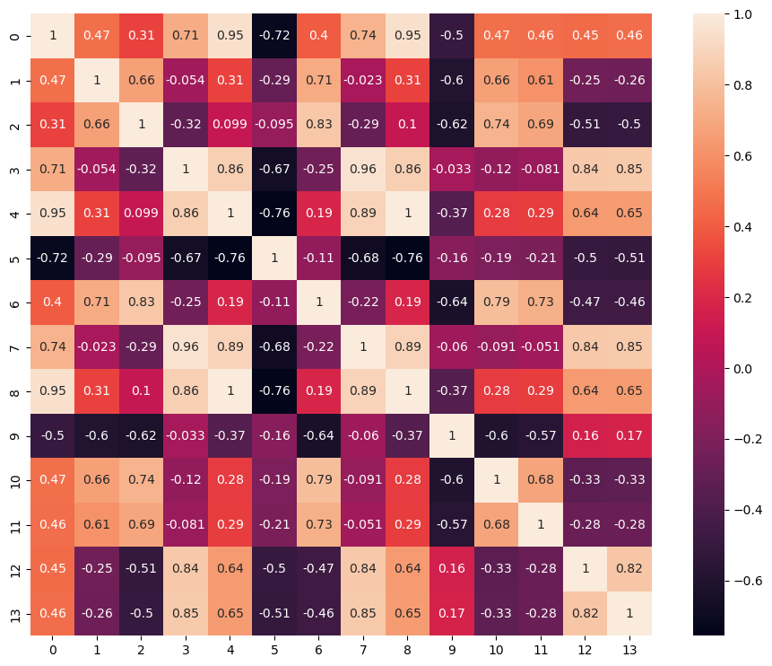

```python
# Importing libraries

import pandas as pd 
import numpy as np
import matplotlib.pyplot as plt
import seaborn as sns
from scipy.stats import mode
from sklearn.model_selection import train_test_split as split
from sklearn.preprocessing import MinMaxScaler
from sklearn.linear_model import LogisticRegression as LR
from sklearn.metrics import confusion_matrix as CM
from sklearn import preprocessing
```


```python
# Load data into dataframe

url = 'sensor_condición.csv'

df_sensors = pd.read_csv(url)
```


```python
df_sensors.head()
```


<div>
<style scoped>
    .dataframe tbody tr th:only-of-type {
        vertical-align: middle;
    }

    .dataframe tbody tr th {
        vertical-align: top;
    }

    .dataframe thead th {
        text-align: right;
    }
</style>
<table border="1" class="dataframe">
  <thead>
    <tr style="text-align: right;">
      <th></th>
      <th>Activo_id</th>
      <th>ciclo</th>
      <th>s1</th>
      <th>s2</th>
      <th>s3</th>
      <th>s4</th>
      <th>s5</th>
      <th>s6</th>
      <th>s7</th>
      <th>s8</th>
      <th>...</th>
      <th>s13</th>
      <th>s14</th>
      <th>s15</th>
      <th>s16</th>
      <th>s17</th>
      <th>s18</th>
      <th>s19</th>
      <th>s20</th>
      <th>s21</th>
      <th>condicion</th>
    </tr>
  </thead>
  <tbody>
    <tr>
      <th>0</th>
      <td>1</td>
      <td>1</td>
      <td>518.67</td>
      <td>641.82</td>
      <td>1589.70</td>
      <td>1400.60</td>
      <td>14.62</td>
      <td>21.61</td>
      <td>554.36</td>
      <td>2388.06</td>
      <td>...</td>
      <td>2388.02</td>
      <td>8138.62</td>
      <td>8.4195</td>
      <td>0.03</td>
      <td>392</td>
      <td>2388</td>
      <td>100</td>
      <td>39.06</td>
      <td>23.4190</td>
      <td>0</td>
    </tr>
    <tr>
      <th>1</th>
      <td>1</td>
      <td>2</td>
      <td>518.67</td>
      <td>642.15</td>
      <td>1591.82</td>
      <td>1403.14</td>
      <td>14.62</td>
      <td>21.61</td>
      <td>553.75</td>
      <td>2388.04</td>
      <td>...</td>
      <td>2388.07</td>
      <td>8131.49</td>
      <td>8.4318</td>
      <td>0.03</td>
      <td>392</td>
      <td>2388</td>
      <td>100</td>
      <td>39.00</td>
      <td>23.4236</td>
      <td>0</td>
    </tr>
    <tr>
      <th>2</th>
      <td>1</td>
      <td>3</td>
      <td>518.67</td>
      <td>642.35</td>
      <td>1587.99</td>
      <td>1404.20</td>
      <td>14.62</td>
      <td>21.61</td>
      <td>554.26</td>
      <td>2388.08</td>
      <td>...</td>
      <td>2388.03</td>
      <td>8133.23</td>
      <td>8.4178</td>
      <td>0.03</td>
      <td>390</td>
      <td>2388</td>
      <td>100</td>
      <td>38.95</td>
      <td>23.3442</td>
      <td>0</td>
    </tr>
    <tr>
      <th>3</th>
      <td>1</td>
      <td>4</td>
      <td>518.67</td>
      <td>642.35</td>
      <td>1582.79</td>
      <td>1401.87</td>
      <td>14.62</td>
      <td>21.61</td>
      <td>554.45</td>
      <td>2388.11</td>
      <td>...</td>
      <td>2388.08</td>
      <td>8133.83</td>
      <td>8.3682</td>
      <td>0.03</td>
      <td>392</td>
      <td>2388</td>
      <td>100</td>
      <td>38.88</td>
      <td>23.3739</td>
      <td>0</td>
    </tr>
    <tr>
      <th>4</th>
      <td>1</td>
      <td>5</td>
      <td>518.67</td>
      <td>642.37</td>
      <td>1582.85</td>
      <td>1406.22</td>
      <td>14.62</td>
      <td>21.61</td>
      <td>554.00</td>
      <td>2388.06</td>
      <td>...</td>
      <td>2388.04</td>
      <td>8133.80</td>
      <td>8.4294</td>
      <td>0.03</td>
      <td>393</td>
      <td>2388</td>
      <td>100</td>
      <td>38.90</td>
      <td>23.4044</td>
      <td>0</td>
    </tr>
  </tbody>
</table>
<p>5 rows × 24 columns</p>
</div>


```python
# Validamos que valores puede tomar la variable dependiente condicion

df_sensors.condicion.unique()
```


    array([0, 1])


#### Validamos que las columnas tienen valores constantes (se conoce porque es el dataset de las clases)


```python
df_sensors.s1.describe()
df_sensors.s5.describe()
df_sensors.s6.describe()
df_sensors.s10.describe()
df_sensors.s16.describe()
df_sensors.s18.describe()
df_sensors.s19.describe()
```


    count    4168.0
    mean      100.0
    std         0.0
    min       100.0
    25%       100.0
    50%       100.0
    75%       100.0
    max       100.0
    Name: s19, dtype: float64


#### Eliminamos los valores constantes


```python
df_sensors = df_sensors.drop(['s1', 's5', 's6', 's10', 's16', 's18', 's19'], axis = 1)
```

#### Validamos que no tengamos valores nulos dentro del dataset


```python
df_sensors.isnull().sum()
```


    Activo_id    0
    ciclo        0
    s2           0
    s3           0
    s4           0
    s7           0
    s8           0
    s9           0
    s11          0
    s12          0
    s13          0
    s14          0
    s15          0
    s17          0
    s20          0
    s21          0
    condicion    0
    dtype: int64


## Pregunta Nº 1 

> Realizar un modelo de regresión logística con la data sensor condicion.xlsx utilizar las variable condicion como target, y s1 hasta s21 como predictoras


```python
varX = df_sensors.iloc[:,2:-1].values
varY = df_sensors.iloc[:,-1].values

pd.DataFrame(varX).head()
```


<div>
<style scoped>
    .dataframe tbody tr th:only-of-type {
        vertical-align: middle;
    }

    .dataframe tbody tr th {
        vertical-align: top;
    }

    .dataframe thead th {
        text-align: right;
    }
</style>
<table border="1" class="dataframe">
  <thead>
    <tr style="text-align: right;">
      <th></th>
      <th>0</th>
      <th>1</th>
      <th>2</th>
      <th>3</th>
      <th>4</th>
      <th>5</th>
      <th>6</th>
      <th>7</th>
      <th>8</th>
      <th>9</th>
      <th>10</th>
      <th>11</th>
      <th>12</th>
      <th>13</th>
    </tr>
  </thead>
  <tbody>
    <tr>
      <th>0</th>
      <td>641.82</td>
      <td>1589.70</td>
      <td>1400.60</td>
      <td>554.36</td>
      <td>2388.06</td>
      <td>9046.19</td>
      <td>47.47</td>
      <td>521.66</td>
      <td>2388.02</td>
      <td>8138.62</td>
      <td>8.4195</td>
      <td>392.0</td>
      <td>39.06</td>
      <td>23.4190</td>
    </tr>
    <tr>
      <th>1</th>
      <td>642.15</td>
      <td>1591.82</td>
      <td>1403.14</td>
      <td>553.75</td>
      <td>2388.04</td>
      <td>9044.07</td>
      <td>47.49</td>
      <td>522.28</td>
      <td>2388.07</td>
      <td>8131.49</td>
      <td>8.4318</td>
      <td>392.0</td>
      <td>39.00</td>
      <td>23.4236</td>
    </tr>
    <tr>
      <th>2</th>
      <td>642.35</td>
      <td>1587.99</td>
      <td>1404.20</td>
      <td>554.26</td>
      <td>2388.08</td>
      <td>9052.94</td>
      <td>47.27</td>
      <td>522.42</td>
      <td>2388.03</td>
      <td>8133.23</td>
      <td>8.4178</td>
      <td>390.0</td>
      <td>38.95</td>
      <td>23.3442</td>
    </tr>
    <tr>
      <th>3</th>
      <td>642.35</td>
      <td>1582.79</td>
      <td>1401.87</td>
      <td>554.45</td>
      <td>2388.11</td>
      <td>9049.48</td>
      <td>47.13</td>
      <td>522.86</td>
      <td>2388.08</td>
      <td>8133.83</td>
      <td>8.3682</td>
      <td>392.0</td>
      <td>38.88</td>
      <td>23.3739</td>
    </tr>
    <tr>
      <th>4</th>
      <td>642.37</td>
      <td>1582.85</td>
      <td>1406.22</td>
      <td>554.00</td>
      <td>2388.06</td>
      <td>9055.15</td>
      <td>47.28</td>
      <td>522.19</td>
      <td>2388.04</td>
      <td>8133.80</td>
      <td>8.4294</td>
      <td>393.0</td>
      <td>38.90</td>
      <td>23.4044</td>
    </tr>
  </tbody>
</table>
</div>


```python
pd.DataFrame(varY).head()
```


<div>
<style scoped>
    .dataframe tbody tr th:only-of-type {
        vertical-align: middle;
    }

    .dataframe tbody tr th {
        vertical-align: top;
    }

    .dataframe thead th {
        text-align: right;
    }
</style>
<table border="1" class="dataframe">
  <thead>
    <tr style="text-align: right;">
      <th></th>
      <th>0</th>
    </tr>
  </thead>
  <tbody>
    <tr>
      <th>0</th>
      <td>0</td>
    </tr>
    <tr>
      <th>1</th>
      <td>0</td>
    </tr>
    <tr>
      <th>2</th>
      <td>0</td>
    </tr>
    <tr>
      <th>3</th>
      <td>0</td>
    </tr>
    <tr>
      <th>4</th>
      <td>0</td>
    </tr>
  </tbody>
</table>
</div>


```python
X_train, X_test, y_train, y_test = split(varX, varY, test_size = 0.25, random_state=0)
print(X_train.shape,X_test.shape)
```

    (3126, 14) (1042, 14)


```python
# Escalar los valores predictores

escaler = MinMaxScaler()
X_train = escaler.fit_transform(X_train.astype('float64'))
X_test  = escaler.transform(X_test.astype('float64'))

X_test[:5,:]
```


    array([[0.40247678, 0.54203852, 0.63639922, 0.42806394, 0.36206897,
            0.26143191, 0.58      , 0.46335697, 0.33823529, 0.2820373 ,
            0.61978947, 0.4       , 0.36220472, 0.22620669],
           [0.29102167, 0.13644904, 0.14344423, 0.70870337, 0.12068966,
            0.18781819, 0.2       , 0.77777778, 0.16176471, 0.17286509,
            0.48757895, 0.3       , 0.78740157, 0.80299591],
           [0.54798762, 0.53123532, 0.62641879, 0.23268206, 0.56896552,
            0.10892996, 0.67333333, 0.3144208 , 0.58823529, 0.06172974,
            0.60926316, 0.6       , 0.30708661, 0.35648358],
           [0.26315789, 0.18060122, 0.24853229, 0.75843694, 0.20689655,
            0.16277576, 0.28666667, 0.73522459, 0.27941176, 0.1816992 ,
            0.33515789, 0.2       , 0.71653543, 0.61703737],
           [0.33126935, 0.23132926, 0.02093933, 0.75666075, 0.06896552,
            0.13621979, 0.22      , 0.76359338, 0.27941176, 0.13807394,
            0.27705263, 0.4       , 0.74015748, 0.52519292]])


```python
# Ajustamos o entrenamos el modelo

classifier = LR(random_state=0)
classifier.fit(X_train, y_train)
```


    LogisticRegression(random_state=0)


```python
dataPredict = classifier.predict(X_test)
dataPredict
```


    array([0, 0, 0, ..., 0, 0, 0])


```python
y_test
```


    array([0, 0, 0, ..., 0, 0, 0])


```python
comparisonTable = pd.DataFrame(np.vstack([dataPredict, y_test])).T

comparison_column = np.where(comparisonTable[0] == comparisonTable[1], True, False)

comparisonTable["assert"] = comparison_column
comparisonTable
```


<div>
<style scoped>
    .dataframe tbody tr th:only-of-type {
        vertical-align: middle;
    }

    .dataframe tbody tr th {
        vertical-align: top;
    }

    .dataframe thead th {
        text-align: right;
    }
</style>
<table border="1" class="dataframe">
  <thead>
    <tr style="text-align: right;">
      <th></th>
      <th>0</th>
      <th>1</th>
      <th>assert</th>
    </tr>
  </thead>
  <tbody>
    <tr>
      <th>0</th>
      <td>0</td>
      <td>0</td>
      <td>True</td>
    </tr>
    <tr>
      <th>1</th>
      <td>0</td>
      <td>0</td>
      <td>True</td>
    </tr>
    <tr>
      <th>2</th>
      <td>0</td>
      <td>0</td>
      <td>True</td>
    </tr>
    <tr>
      <th>3</th>
      <td>0</td>
      <td>0</td>
      <td>True</td>
    </tr>
    <tr>
      <th>4</th>
      <td>0</td>
      <td>0</td>
      <td>True</td>
    </tr>
    <tr>
      <th>...</th>
      <td>...</td>
      <td>...</td>
      <td>...</td>
    </tr>
    <tr>
      <th>1037</th>
      <td>0</td>
      <td>0</td>
      <td>True</td>
    </tr>
    <tr>
      <th>1038</th>
      <td>0</td>
      <td>0</td>
      <td>True</td>
    </tr>
    <tr>
      <th>1039</th>
      <td>0</td>
      <td>0</td>
      <td>True</td>
    </tr>
    <tr>
      <th>1040</th>
      <td>0</td>
      <td>0</td>
      <td>True</td>
    </tr>
    <tr>
      <th>1041</th>
      <td>0</td>
      <td>0</td>
      <td>True</td>
    </tr>
  </tbody>
</table>
<p>1042 rows × 3 columns</p>
</div>


```python
len(comparisonTable[comparisonTable["assert"] == False])
```


    20


```python
(20/1042)
```


    0.019193857965451054


```python
# Creamos la Matriz de Confusión para evaluar la clasificación realizada mediante sklearn

matrix = CM(y_test, dataPredict)
matrix
```


    array([[933,   7],
           [ 13,  89]])


```python
score = (933+89) / matrix.sum()
score
```


    0.980806142034549


> De las 1042 pruebas (data de test), solo ha fallado en 20 predicciones. Tenemos un error del 1.9%.

**Es decir, tenemos el 98.1 % de exactitud.**


## Pregunta Nº 2 

> Verificar correlaciones entre variables predictoras, indicar si existe problema de multicolinealidad entre las variables predictoras. (si hay problema entre que variables??)


```python
# Normalizamos la data con el método preprocessing de la libreria de sklearn.

normalizedData = preprocessing.normalize(df_sensors.iloc[:,2:-1])
pd.DataFrame(normalizedData)
```


<div>
<style scoped>
    .dataframe tbody tr th:only-of-type {
        vertical-align: middle;
    }

    .dataframe tbody tr th {
        vertical-align: top;
    }

    .dataframe thead th {
        text-align: right;
    }
</style>
<table border="1" class="dataframe">
  <thead>
    <tr style="text-align: right;">
      <th></th>
      <th>0</th>
      <th>1</th>
      <th>2</th>
      <th>3</th>
      <th>4</th>
      <th>5</th>
      <th>6</th>
      <th>7</th>
      <th>8</th>
      <th>9</th>
      <th>10</th>
      <th>11</th>
      <th>12</th>
      <th>13</th>
    </tr>
  </thead>
  <tbody>
    <tr>
      <th>0</th>
      <td>0.049948</td>
      <td>0.123715</td>
      <td>0.108999</td>
      <td>0.043142</td>
      <td>0.185846</td>
      <td>0.704001</td>
      <td>0.003694</td>
      <td>0.040597</td>
      <td>0.185843</td>
      <td>0.633371</td>
      <td>0.000655</td>
      <td>0.030507</td>
      <td>0.003040</td>
      <td>0.001823</td>
    </tr>
    <tr>
      <th>1</th>
      <td>0.049995</td>
      <td>0.123933</td>
      <td>0.109243</td>
      <td>0.043113</td>
      <td>0.185923</td>
      <td>0.704134</td>
      <td>0.003697</td>
      <td>0.040663</td>
      <td>0.185925</td>
      <td>0.633085</td>
      <td>0.000656</td>
      <td>0.030520</td>
      <td>0.003036</td>
      <td>0.001824</td>
    </tr>
    <tr>
      <th>2</th>
      <td>0.049984</td>
      <td>0.123567</td>
      <td>0.109266</td>
      <td>0.043129</td>
      <td>0.185825</td>
      <td>0.704443</td>
      <td>0.003678</td>
      <td>0.040651</td>
      <td>0.185821</td>
      <td>0.632877</td>
      <td>0.000655</td>
      <td>0.030347</td>
      <td>0.003031</td>
      <td>0.001816</td>
    </tr>
    <tr>
      <th>3</th>
      <td>0.049995</td>
      <td>0.123190</td>
      <td>0.109109</td>
      <td>0.043153</td>
      <td>0.185869</td>
      <td>0.704330</td>
      <td>0.003668</td>
      <td>0.040695</td>
      <td>0.185867</td>
      <td>0.633064</td>
      <td>0.000651</td>
      <td>0.030510</td>
      <td>0.003026</td>
      <td>0.001819</td>
    </tr>
    <tr>
      <th>4</th>
      <td>0.049979</td>
      <td>0.123152</td>
      <td>0.109410</td>
      <td>0.043104</td>
      <td>0.185801</td>
      <td>0.704529</td>
      <td>0.003679</td>
      <td>0.040629</td>
      <td>0.185800</td>
      <td>0.632844</td>
      <td>0.000656</td>
      <td>0.030577</td>
      <td>0.003027</td>
      <td>0.001821</td>
    </tr>
    <tr>
      <th>...</th>
      <td>...</td>
      <td>...</td>
      <td>...</td>
      <td>...</td>
      <td>...</td>
      <td>...</td>
      <td>...</td>
      <td>...</td>
      <td>...</td>
      <td>...</td>
      <td>...</td>
      <td>...</td>
      <td>...</td>
      <td>...</td>
    </tr>
    <tr>
      <th>4163</th>
      <td>0.049978</td>
      <td>0.124691</td>
      <td>0.111162</td>
      <td>0.042882</td>
      <td>0.185463</td>
      <td>0.704541</td>
      <td>0.003740</td>
      <td>0.040391</td>
      <td>0.185463</td>
      <td>0.632443</td>
      <td>0.000659</td>
      <td>0.030752</td>
      <td>0.002998</td>
      <td>0.001796</td>
    </tr>
    <tr>
      <th>4164</th>
      <td>0.049990</td>
      <td>0.124481</td>
      <td>0.111001</td>
      <td>0.042766</td>
      <td>0.185417</td>
      <td>0.704603</td>
      <td>0.003758</td>
      <td>0.040352</td>
      <td>0.185417</td>
      <td>0.632477</td>
      <td>0.000658</td>
      <td>0.030822</td>
      <td>0.003008</td>
      <td>0.001785</td>
    </tr>
    <tr>
      <th>4165</th>
      <td>0.050000</td>
      <td>0.124876</td>
      <td>0.111213</td>
      <td>0.042816</td>
      <td>0.185469</td>
      <td>0.704805</td>
      <td>0.003741</td>
      <td>0.040327</td>
      <td>0.185471</td>
      <td>0.632102</td>
      <td>0.000662</td>
      <td>0.030830</td>
      <td>0.002977</td>
      <td>0.001797</td>
    </tr>
    <tr>
      <th>4166</th>
      <td>0.049992</td>
      <td>0.124366</td>
      <td>0.111582</td>
      <td>0.042830</td>
      <td>0.185416</td>
      <td>0.704719</td>
      <td>0.003744</td>
      <td>0.040369</td>
      <td>0.185414</td>
      <td>0.632267</td>
      <td>0.000660</td>
      <td>0.030744</td>
      <td>0.002986</td>
      <td>0.001784</td>
    </tr>
    <tr>
      <th>4167</th>
      <td>0.050011</td>
      <td>0.124155</td>
      <td>0.111145</td>
      <td>0.042855</td>
      <td>0.185507</td>
      <td>0.704547</td>
      <td>0.003740</td>
      <td>0.040369</td>
      <td>0.185503</td>
      <td>0.632516</td>
      <td>0.000664</td>
      <td>0.030836</td>
      <td>0.002996</td>
      <td>0.001786</td>
    </tr>
  </tbody>
</table>
<p>4168 rows × 14 columns</p>
</div>


```python
# Crearemos un heatmap para validar mediante un cuadro de correlación si las variables independientes tiene multicolinealidad
# Matriz de correlación:

plt.figure(figsize=(12,9))
corrmat = pd.DataFrame(normalizedData).corr()
sns.heatmap(corrmat, square=True, annot=True);
plt.show()
```


    

    


```python
df_sensors.iloc[:,2:-1].head()
```


<div>
<style scoped>
    .dataframe tbody tr th:only-of-type {
        vertical-align: middle;
    }

    .dataframe tbody tr th {
        vertical-align: top;
    }

    .dataframe thead th {
        text-align: right;
    }
</style>
<table border="1" class="dataframe">
  <thead>
    <tr style="text-align: right;">
      <th></th>
      <th>s2</th>
      <th>s3</th>
      <th>s4</th>
      <th>s7</th>
      <th>s8</th>
      <th>s9</th>
      <th>s11</th>
      <th>s12</th>
      <th>s13</th>
      <th>s14</th>
      <th>s15</th>
      <th>s17</th>
      <th>s20</th>
      <th>s21</th>
    </tr>
  </thead>
  <tbody>
    <tr>
      <th>0</th>
      <td>641.82</td>
      <td>1589.70</td>
      <td>1400.60</td>
      <td>554.36</td>
      <td>2388.06</td>
      <td>9046.19</td>
      <td>47.47</td>
      <td>521.66</td>
      <td>2388.02</td>
      <td>8138.62</td>
      <td>8.4195</td>
      <td>392</td>
      <td>39.06</td>
      <td>23.4190</td>
    </tr>
    <tr>
      <th>1</th>
      <td>642.15</td>
      <td>1591.82</td>
      <td>1403.14</td>
      <td>553.75</td>
      <td>2388.04</td>
      <td>9044.07</td>
      <td>47.49</td>
      <td>522.28</td>
      <td>2388.07</td>
      <td>8131.49</td>
      <td>8.4318</td>
      <td>392</td>
      <td>39.00</td>
      <td>23.4236</td>
    </tr>
    <tr>
      <th>2</th>
      <td>642.35</td>
      <td>1587.99</td>
      <td>1404.20</td>
      <td>554.26</td>
      <td>2388.08</td>
      <td>9052.94</td>
      <td>47.27</td>
      <td>522.42</td>
      <td>2388.03</td>
      <td>8133.23</td>
      <td>8.4178</td>
      <td>390</td>
      <td>38.95</td>
      <td>23.3442</td>
    </tr>
    <tr>
      <th>3</th>
      <td>642.35</td>
      <td>1582.79</td>
      <td>1401.87</td>
      <td>554.45</td>
      <td>2388.11</td>
      <td>9049.48</td>
      <td>47.13</td>
      <td>522.86</td>
      <td>2388.08</td>
      <td>8133.83</td>
      <td>8.3682</td>
      <td>392</td>
      <td>38.88</td>
      <td>23.3739</td>
    </tr>
    <tr>
      <th>4</th>
      <td>642.37</td>
      <td>1582.85</td>
      <td>1406.22</td>
      <td>554.00</td>
      <td>2388.06</td>
      <td>9055.15</td>
      <td>47.28</td>
      <td>522.19</td>
      <td>2388.04</td>
      <td>8133.80</td>
      <td>8.4294</td>
      <td>393</td>
      <td>38.90</td>
      <td>23.4044</td>
    </tr>
  </tbody>
</table>
</div>


Se valida que existen features (variables independientes) con multicolinealidad; es decir, existen variables que podrían depurarse porque su existencia dentro del dataset no agrega valor para predecir la condición.

Algunas variables que presentan este problema son:


| Variable 1 | Variable 2 |
|----|----|
| S1 | S2 |
| S1 | S5 |
| S1 | S6 |
| S1 | S8 |
| S1 | S13 |
| S1 | S16 |
| S1 | S18 |
| S1 | S19 |
| S2 | S5 |
| S2 | S6 |
| S2 | S8 |
| S2 | S13 |
...
...
...

> Esto también se debe a que existen features con valores constantes.

## Pregunta Nº 3 

> Escoger 3 variables predictoras y verificar la fuerza de asociación con la variable target condición (asociación entre variable numérica con categórica)


```python
%load_ext rpy2.ipython
```


```r
%%R

data_sensors = read.csv(file = 'sensor_condición.csv', sep = ',')

data_sensors$s1 = NULL
data_sensors$s5 = NULL
data_sensors$s6 = NULL
data_sensors$s10 = NULL
data_sensors$s16 = NULL
data_sensors$s18 = NULL
data_sensors$s19 = NULL

head(data_sensors) 
```

      Activo_id ciclo     s2      s3      s4     s7      s8      s9   s11    s12
    1         1     1 641.82 1589.70 1400.60 554.36 2388.06 9046.19 47.47 521.66
    2         1     2 642.15 1591.82 1403.14 553.75 2388.04 9044.07 47.49 522.28
    3         1     3 642.35 1587.99 1404.20 554.26 2388.08 9052.94 47.27 522.42
    4         1     4 642.35 1582.79 1401.87 554.45 2388.11 9049.48 47.13 522.86
    5         1     5 642.37 1582.85 1406.22 554.00 2388.06 9055.15 47.28 522.19
    6         1     6 642.10 1584.47 1398.37 554.67 2388.02 9049.68 47.16 521.68
          s13     s14    s15 s17   s20     s21 condicion
    1 2388.02 8138.62 8.4195 392 39.06 23.4190         0
    2 2388.07 8131.49 8.4318 392 39.00 23.4236         0
    3 2388.03 8133.23 8.4178 390 38.95 23.3442         0
    4 2388.08 8133.83 8.3682 392 38.88 23.3739         0
    5 2388.04 8133.80 8.4294 393 38.90 23.4044         0
    6 2388.03 8132.85 8.4108 391 38.98 23.3669         0


```r
%%R

install.packages('CTT')
library(CTT) 
```

    --- Please select a CRAN mirror for use in this session ---
    Secure CRAN mirrors 
    
     1: 0-Cloud [https]
     2: Australia (Canberra) [https]
     3: Australia (Melbourne 1) [https]
     4: Australia (Melbourne 2) [https]
     5: Australia (Perth) [https]
     6: Austria [https]
     7: Belgium (Brussels) [https]
     8: Brazil (PR) [https]
     9: Brazil (RJ) [https]
    10: Brazil (SP 1) [https]
    11: Brazil (SP 2) [https]
    12: Bulgaria [https]
    13: Canada (MB) [https]
    14: Canada (ON 2) [https]
    15: Canada (ON 3) [https]
    16: Chile (Santiago) [https]
    17: China (Beijing 2) [https]
    18: China (Hefei) [https]
    19: China (Hong Kong) [https]
    20: China (Guangzhou) [https]
    21: China (Lanzhou) [https]
    22: China (Nanjing) [https]
    23: China (Shanghai 1) [https]
    24: China (Shanghai 2) [https]
    25: China (Shenzhen) [https]
    26: Costa Rica [https]
    27: Cyprus [https]
    28: Czech Republic [https]
    29: Denmark [https]
    30: East Asia [https]
    31: Ecuador (Cuenca) [https]
    32: Ecuador (Quito) [https]
    33: Estonia [https]
    34: France (Lyon 1) [https]
    35: France (Lyon 2) [https]
    36: France (Marseille) [https]
    37: France (Montpellier) [https]
    38: France (Paris 1) [https]
    39: Germany (Erlangen) [https]
    40: Germany (Leipzig) [https]
    41: Germany (Göttingen) [https]
    42: Germany (Münster) [https]
    43: Germany (Regensburg) [https]
    44: Greece [https]
    45: Hungary [https]
    46: Iceland [https]
    47: India [https]
    48: Indonesia (Jakarta) [https]
    49: Iran [https]
    50: Italy (Milano) [https]
    51: Italy (Padua) [https]
    52: Japan (Tokyo) [https]
    53: Korea (Gyeongsan-si) [https]
    54: Korea (Seoul 1) [https]
    55: Korea (Ulsan) [https]
    56: Malaysia [https]
    57: Mexico (Mexico City) [https]
    58: Mexico (Texcoco) [https]
    59: Morocco [https]
    60: Netherlands [https]
    61: New Zealand [https]
    62: Norway [https]
    63: Russia (Moscow) [https]
    64: South Africa (Johannesburg) [https]
    65: Spain (A Coruña) [https]
    66: Spain (Madrid) [https]
    67: Sweden (Borås) [https]
    68: Sweden (Umeå) [https]
    69: Switzerland [https]
    70: Taiwan (Taipei) [https]
    71: Turkey (Denizli) [https]
    72: Turkey (Istanbul) [https]
    73: Turkey (Mersin) [https]
    74: UK (Bristol) [https]
    75: UK (London 1) [https]
    76: USA (IA) [https]
    77: USA (KS) [https]
    78: USA (MI) [https]
    79: USA (OH) [https]
    80: USA (OR) [https]
    81: USA (TN) [https]
    82: USA (TX 1) [https]
    83: Uruguay [https]
    84: (other mirrors)
    
    Selection: 8


    R[write to console]: trying URL 'https://cran-r.c3sl.ufpr.br/src/contrib/CTT_2.3.3.tar.gz'
    
    R[write to console]: Content type 'application/x-gzip'
    R[write to console]:  length 17062 bytes (16 KB)
    
    R[write to console]: =
    R[write to console]: =
    R[write to console]: =
    R[write to console]: =
    R[write to console]: =
    R[write to console]: =
    R[write to console]: =
    R[write to console]: =
    R[write to console]: =
    R[write to console]: =
    R[write to console]: =
    R[write to console]: =
    R[write to console]: =
    R[write to console]: =
    R[write to console]: =
    R[write to console]: =
    R[write to console]: =
    R[write to console]: =
    R[write to console]: =
    R[write to console]: =
    R[write to console]: =
    R[write to console]: =
    R[write to console]: =
    R[write to console]: =
    R[write to console]: =
    R[write to console]: =
    R[write to console]: =
    R[write to console]: =
    R[write to console]: =
    R[write to console]: =
    R[write to console]: =
    R[write to console]: =
    R[write to console]: =
    R[write to console]: =
    R[write to console]: =
    R[write to console]: =
    R[write to console]: =
    R[write to console]: =
    R[write to console]: =
    R[write to console]: =
    R[write to console]: =
    R[write to console]: =
    R[write to console]: =
    R[write to console]: =
    R[write to console]: =
    R[write to console]: =
    R[write to console]: =
    R[write to console]: =
    R[write to console]: =
    R[write to console]: =
    R[write to console]: 
    
    R[write to console]: downloaded 16 KB
    
    
    R[write to console]: 
    
    R[write to console]: 
    R[write to console]: The downloaded source packages are in
    	‘/private/var/folders/j3/m3sy6zld00ggzypxy638ltmh0000gn/T/RtmpYYnLsW/downloaded_packages’
    R[write to console]: 
    R[write to console]: 
    
    R[write to console]: Updating HTML index of packages in '.Library'
    
    R[write to console]: Making 'packages.html' ...
    R[write to console]:  done
    


```r
%%R

polyserial(data_sensors$s2, data_sensors$condicion)
```

              
    0.8390407 


```r
%%R

polyserial(data_sensors$s9, data_sensors$condicion)
```

              
    0.4462293 


```r
%%R


polyserial(data_sensors$s14, data_sensors$condicion)
```

              
    0.3866612 


Mientras que la variable numérica **S2** tiene una **asociación muy fuerte** con la variable categórica **condición**, las variables numéricas **s9** y **s14** tiene una **asociación modeada** con la variable categórica **condición**.

## Pregunta Nº 4 

> Crear un histograma que muestre en que valor de ciclos es más probable la falla de los aviones
