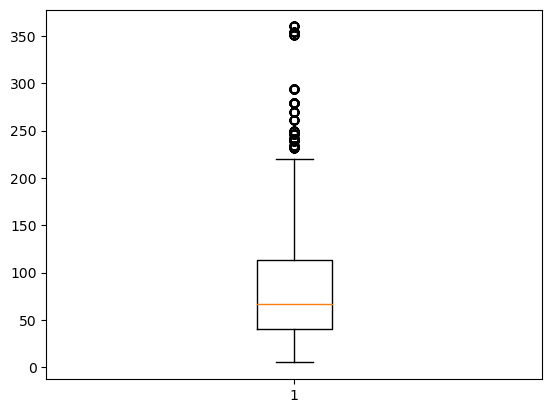
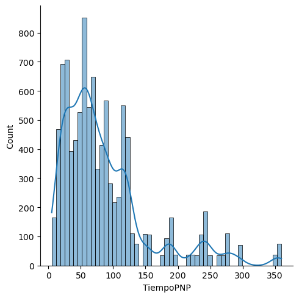
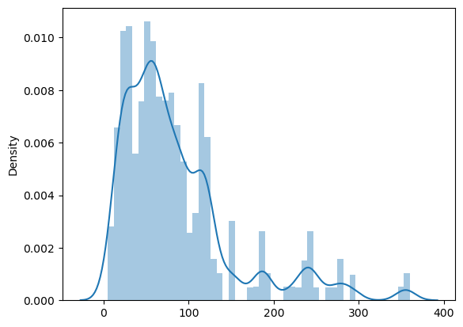
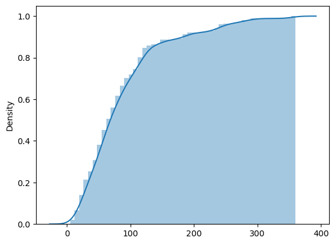
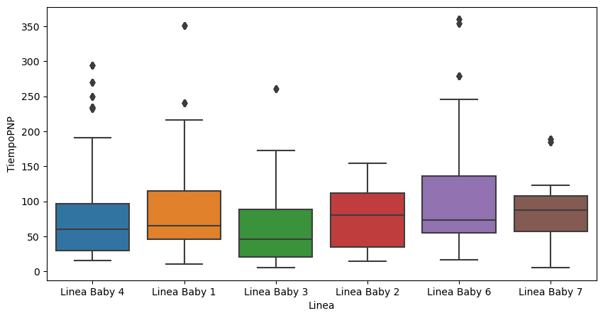
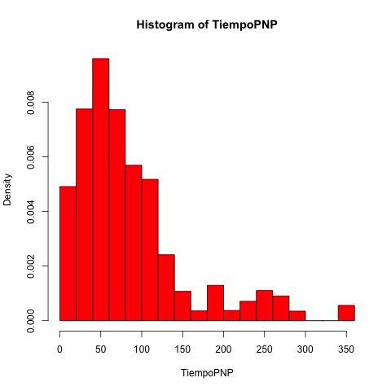

```python
# Importing libraries

import pandas as pd 
import numpy as np
import matplotlib.pyplot as plt
import seaborn as sns
from scipy.stats import mode
```


```python
# Load data into dataframe

url = 'data lac.xlsx'

df_lac = pd.read_excel(url)
df_lac.head()
```

<div>
<table border="1" class="dataframe">
  <thead>
    <tr style="text-align: right;">
      <th></th>
      <th>FechaProgramacion</th>
      <th>Fabrica</th>
      <th>Seccion</th>
      <th>Linea</th>
      <th>Equipo</th>
      <th>TiempoPNP</th>
    </tr>
  </thead>
  <tbody>
    <tr>
      <th>0</th>
      <td>2018-07-19</td>
      <td>Envases</td>
      <td>Envasado Evaporada</td>
      <td>Linea Baby 4</td>
      <td>TRANSP CABLE ELEVADO ENFRIADOR</td>
      <td>45.0</td>
    </tr>
    <tr>
      <th>1</th>
      <td>2018-07-19</td>
      <td>Envases</td>
      <td>Envasado Evaporada</td>
      <td>Linea Baby 4</td>
      <td>TRANSP CABLE ELEVADO CERRADORA</td>
      <td>45.0</td>
    </tr>
    <tr>
      <th>2</th>
      <td>2018-07-19</td>
      <td>Envases</td>
      <td>Envasado Evaporada</td>
      <td>Linea Baby 4</td>
      <td>TABLERO AUTOMATISMO ESTERILIZADOR</td>
      <td>45.0</td>
    </tr>
    <tr>
      <th>3</th>
      <td>2018-07-19</td>
      <td>Envases</td>
      <td>Envasado Evaporada</td>
      <td>Linea Baby 4</td>
      <td>ROBOT PALETIZADOR KUKA</td>
      <td>45.0</td>
    </tr>
    <tr>
      <th>4</th>
      <td>2018-07-19</td>
      <td>Envases</td>
      <td>Envasado Evaporada</td>
      <td>Linea Baby 4</td>
      <td>ETIQUETADORA</td>
      <td>45.0</td>
    </tr>
  </tbody>
</table>
</div>


### Pregunta Nº 1: 

> **_Realizar un análisis exploratorio de datos (Selección de filas, columnas, agrupación de variables con funciones de agregación)_**


```python
# Mostrando las medidas de tendecia central de la variable cuantitativa (numérica)

df_lac.describe()

# Cantidad de Registros: 9999
# Media de los datos: 85.94
# Desviación estandar: 67.77
# Valor mínimo: 5
# Valor del primer quartil: 40
# Valor de la mediana (segundo quartil): 67
# Valor del tercer quartil: 113
# Valor máximo: 360
```

<div>
<table border="1" class="dataframe">
  <thead>
    <tr style="text-align: right;">
      <th></th>
      <th>TiempoPNP</th>
    </tr>
  </thead>
  <tbody>
    <tr>
      <th>count</th>
      <td>9999.000000</td>
    </tr>
    <tr>
      <th>mean</th>
      <td>85.944594</td>
    </tr>
    <tr>
      <th>std</th>
      <td>67.778384</td>
    </tr>
    <tr>
      <th>min</th>
      <td>5.000000</td>
    </tr>
    <tr>
      <th>25%</th>
      <td>40.000000</td>
    </tr>
    <tr>
      <th>50%</th>
      <td>67.000000</td>
    </tr>
    <tr>
      <th>75%</th>
      <td>113.000000</td>
    </tr>
    <tr>
      <th>max</th>
      <td>360.000000</td>
    </tr>
  </tbody>
</table>
</div>


```python
# Obteniendo los valores únicos de la columna Linea
np.unique(df_lac.Linea)
```


    array(['Linea Baby 1', 'Linea Baby 2', 'Linea Baby 3', 'Linea Baby 4',
           'Linea Baby 6', 'Linea Baby 7'], dtype=object)


```python
# Desviación estándar para el feature FechaProgramación
np.std(df_lac.FechaProgramacion, ddof = 1)
```


    Timedelta('185 days 21:55:27.827587962')


```python
# Desviación estándar para el feature TiempoPNP
np.std(df_lac.TiempoPNP, ddof = 1)
```


    67.77838381368686


### Pregunta Nº 2: 

> **_Realizar boxplots e histogramas de la variable numérica (comparar) medidas de tendencia central y estadísticos de posición. (TiempoPNP)_**


```python
plt.boxplot(df_lac.TiempoPNP)
plt.show()

# La mediana del feature TiempoPNP es 67. Esto se puede visualizar en el boxplot a continuación.
```


    

    


1. Valor mínimo: 5 
1. Valor del primer quartil: 40
1. Valor de la mediana (segundo quartil): 67
1. Valor del tercer quartil: 113
1. Valor máximo: 360

Los valores indicados arriba, se pueden visualizar facilmente en el boxplot.


```python
# Calculando la moda de TiempoPNP
mode(df_lac.TiempoPNP)
```


    ModeResult(mode=array([20.]), count=array([315]))


```python
# Histograma del feature TiempoPNP 
sns.displot(x = df_lac.TiempoPNP, kde = True, kde_kws = {'cumulative': True});
plt.show()
```


    

    


```python
# Histograma del feature TiempoPNP Normalizada
sns.distplot(x = df_lac.TiempoPNP, kde = True,);
plt.show()
```

    

    


```python
# Histograma del feature TiempoPNP (Acumulado)
sns.distplot(x = df_lac.TiempoPNP, kde = True, hist_kws = {'cumulative': True}, kde_kws = {'cumulative': True});
plt.show()
```
    

    


```python
# Boxplot Linea / TiempoPNP

plt.figure(figsize=(10,5))
fig = sns.boxplot(x="Linea", y="TiempoPNP", data=df_lac)
plt.show()
```


    

    


Analisis del feature cuantitativo (TiempoPNP) con una de las variables categóricas (Linea)

### Pregunta Nº 3: 
> **_Hacer un modelo weibull con el tiempo PNP indicar los parámetros de forma (shape) y escala del modelo_**


```python
%load_ext rpy2.ipython
```


```r
%%R

install.packages('rriskDistributions')
install.packages('MASS')
install.packages('dplyr')

library(rriskDistributions)
library(MASS)
library(dplyr)
```

```r
%%R


data = read.csv(file = 'data lac.csv', sep = ',') # cambiar por tu ruta local
head(data) 

data = data %>%
  select(TiempoPNP) 

TiempoPNP = data$TiempoPNP

hist(TiempoPNP, col = 'red', freq = 0)
```


    

    


```r
%%R

# Calculando los valores de escala y de forma
fitdistr(TiempoPNP, densfun = 'weibull')

```

          shape         scale   
       1.37752840   94.63353969 
     ( 0.01021116) ( 0.72733571)


#### Se intentó revalidar los valores arrojados, pero no se pudo debido a un error con una libreria.

fit.cont(TiempoPNP)

#### Tengo problemas con una libreria X11 para plotear externamente.

> RInterpreterError: Failed to parse and evaluate line '\nfit.cont(TiempoPNP)\n. R error message: "Error: .onLoad failed in loadNamespace() for 'tcltk', details:\n  call: fun(libname, pkgname)\n  error: X11 library is missing: install XQuartz from www.xquartz.org"


```r
%%R

pweibull(100, 1.37752, 94.6335) - pweibull(20, 1.37752, 94.6335) 
```

    [1] 0.5491581


Validamos que existe un 54.9% de probabilidades de encontrar valores entre 20 y 100


```r
%%R

1 - pweibull(100, 1.37752, 94.6335) 
```

    [1] 0.3399546


Validamos que existe un 33.9% de probabilidades de encontrar valores mayores a 100


```r
%%R

pweibull(20, 1.37752, 94.6335) 
```

    [1] 0.1108873


Validamos que existe un 11% de probabilidades de encontrar valores menores a 20
