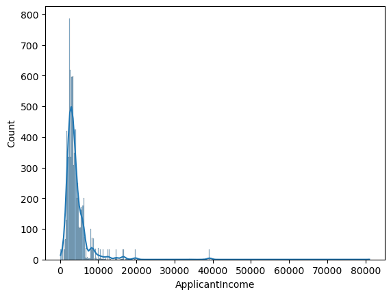
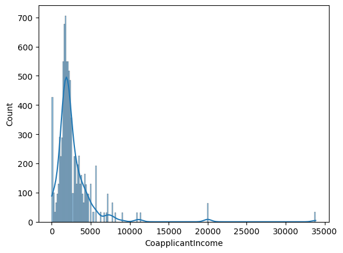
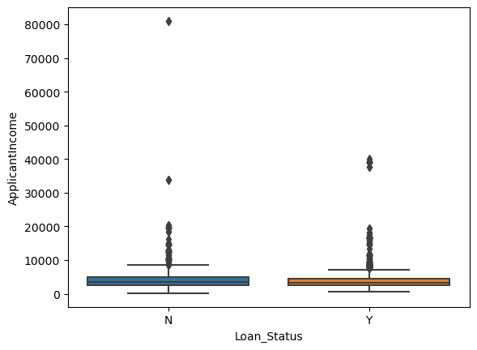
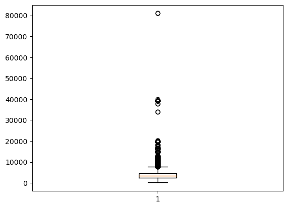
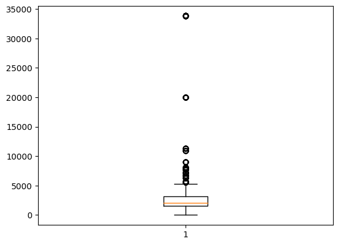
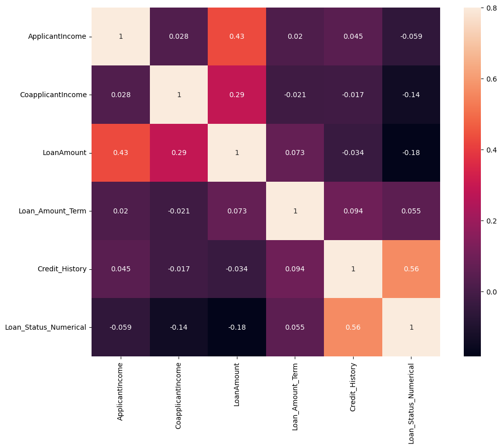
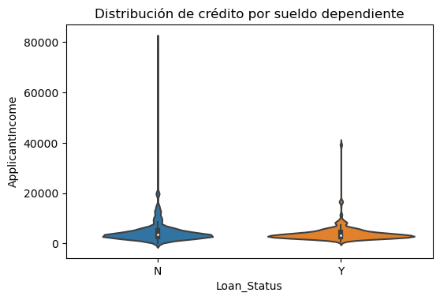
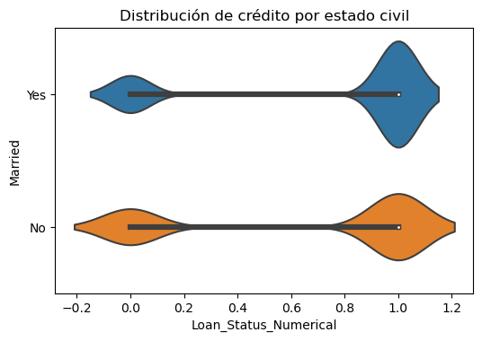

```python
# Importing libraries

import pandas as pd 
import numpy as np
import matplotlib.pyplot as plt
import seaborn as sns
from scipy.stats import f_oneway
```


```python
df_loan = pd.read_csv('loan_prediction-II.csv', sep = ';')

# Agregamos un campo numérico de la variable dependiente.
df_loan['Loan_Status_Numerical'] = pd.factorize(df_loan['Loan_Status'])[0]

#Limpiamos el dataset quitando los registros que tengan valores nulos
df_loan.dropna(inplace = True)
df_loan
```


<div>
<style scoped>
    .dataframe tbody tr th:only-of-type {
        vertical-align: middle;
    }

    .dataframe tbody tr th {
        vertical-align: top;
    }

    .dataframe thead th {
        text-align: right;
    }
</style>
<table border="1" class="dataframe">
  <thead>
    <tr style="text-align: right;">
      <th></th>
      <th>Loan_ID</th>
      <th>Gender</th>
      <th>Married</th>
      <th>Dependents</th>
      <th>Education</th>
      <th>Self_Employed</th>
      <th>ApplicantIncome</th>
      <th>CoapplicantIncome</th>
      <th>LoanAmount</th>
      <th>Loan_Amount_Term</th>
      <th>Credit_History</th>
      <th>Property_Area</th>
      <th>Nacionality</th>
      <th>Loan_Status</th>
      <th>Loan_Status_Numerical</th>
    </tr>
  </thead>
  <tbody>
    <tr>
      <th>0</th>
      <td>LP001001</td>
      <td>Male</td>
      <td>Yes</td>
      <td>1</td>
      <td>Graduate</td>
      <td>No</td>
      <td>4583</td>
      <td>1508</td>
      <td>128.0</td>
      <td>360.0</td>
      <td>1.0</td>
      <td>Rural</td>
      <td>F</td>
      <td>N</td>
      <td>0</td>
    </tr>
    <tr>
      <th>1</th>
      <td>LP001002</td>
      <td>Male</td>
      <td>Yes</td>
      <td>0</td>
      <td>Not Graduate</td>
      <td>No</td>
      <td>2583</td>
      <td>2358</td>
      <td>120.0</td>
      <td>360.0</td>
      <td>1.0</td>
      <td>Urban</td>
      <td>N</td>
      <td>Y</td>
      <td>1</td>
    </tr>
    <tr>
      <th>2</th>
      <td>LP001003</td>
      <td>Male</td>
      <td>Yes</td>
      <td>2</td>
      <td>Graduate</td>
      <td>Yes</td>
      <td>5417</td>
      <td>4196</td>
      <td>267.0</td>
      <td>360.0</td>
      <td>1.0</td>
      <td>Urban</td>
      <td>N</td>
      <td>Y</td>
      <td>1</td>
    </tr>
    <tr>
      <th>3</th>
      <td>LP001004</td>
      <td>Male</td>
      <td>Yes</td>
      <td>0</td>
      <td>Not Graduate</td>
      <td>No</td>
      <td>2333</td>
      <td>1516</td>
      <td>95.0</td>
      <td>360.0</td>
      <td>1.0</td>
      <td>Urban</td>
      <td>N</td>
      <td>Y</td>
      <td>1</td>
    </tr>
    <tr>
      <th>4</th>
      <td>LP001005</td>
      <td>Male</td>
      <td>Yes</td>
      <td>3+</td>
      <td>Graduate</td>
      <td>No</td>
      <td>3036</td>
      <td>2504</td>
      <td>158.0</td>
      <td>360.0</td>
      <td>0.0</td>
      <td>Semiurban</td>
      <td>N</td>
      <td>N</td>
      <td>0</td>
    </tr>
    <tr>
      <th>...</th>
      <td>...</td>
      <td>...</td>
      <td>...</td>
      <td>...</td>
      <td>...</td>
      <td>...</td>
      <td>...</td>
      <td>...</td>
      <td>...</td>
      <td>...</td>
      <td>...</td>
      <td>...</td>
      <td>...</td>
      <td>...</td>
      <td>...</td>
    </tr>
    <tr>
      <th>11492</th>
      <td>LP012493</td>
      <td>Male</td>
      <td>Yes</td>
      <td>3+</td>
      <td>Graduate</td>
      <td>No</td>
      <td>8750</td>
      <td>4996</td>
      <td>130.0</td>
      <td>360.0</td>
      <td>1.0</td>
      <td>Rural</td>
      <td>N</td>
      <td>Y</td>
      <td>1</td>
    </tr>
    <tr>
      <th>11494</th>
      <td>LP012495</td>
      <td>Male</td>
      <td>No</td>
      <td>0</td>
      <td>Graduate</td>
      <td>No</td>
      <td>5941</td>
      <td>4232</td>
      <td>296.0</td>
      <td>360.0</td>
      <td>1.0</td>
      <td>Semiurban</td>
      <td>N</td>
      <td>Y</td>
      <td>1</td>
    </tr>
    <tr>
      <th>11495</th>
      <td>LP012496</td>
      <td>Male</td>
      <td>No</td>
      <td>0</td>
      <td>Not Graduate</td>
      <td>No</td>
      <td>2346</td>
      <td>1600</td>
      <td>132.0</td>
      <td>360.0</td>
      <td>1.0</td>
      <td>Semiurban</td>
      <td>N</td>
      <td>Y</td>
      <td>1</td>
    </tr>
    <tr>
      <th>11497</th>
      <td>LP012498</td>
      <td>Male</td>
      <td>Yes</td>
      <td>0</td>
      <td>Graduate</td>
      <td>No</td>
      <td>2333</td>
      <td>2417</td>
      <td>136.0</td>
      <td>360.0</td>
      <td>1.0</td>
      <td>Urban</td>
      <td>N</td>
      <td>Y</td>
      <td>1</td>
    </tr>
    <tr>
      <th>11499</th>
      <td>LP012500</td>
      <td>Male</td>
      <td>Yes</td>
      <td>2</td>
      <td>Not Graduate</td>
      <td>No</td>
      <td>1993</td>
      <td>1625</td>
      <td>113.0</td>
      <td>180.0</td>
      <td>1.0</td>
      <td>Semiurban</td>
      <td>N</td>
      <td>Y</td>
      <td>1</td>
    </tr>
  </tbody>
</table>
<p>8910 rows × 15 columns</p>
</div>


### Pregunta Nº 1: 

> **_Definir el problema de la naturaleza que se tiene a continuación, además de los objetivos de negocio bien definidos_**

El problema identificado es la demora en la evaluación de la calificación de un crédito personal a un cliente de la entidad financiera. Por lo cual, la empresa se ve en la necesidad de implenentar un modelo en base a sus datos históricos, si el cliente solicitante califica o no a la solicitud de crédito.

------------------

### Pregunta Nº 2

> **_¿Qué tipo de variables se utilizan en el problema de negocio?_**

Las variables utilizadas en este dataset son:

- Categóricos Nominales
- Cuantitativas Discretas
- Cuantitativas Continuas


```python
df_loan.describe()
```


<div>
<style scoped>
    .dataframe tbody tr th:only-of-type {
        vertical-align: middle;
    }

    .dataframe tbody tr th {
        vertical-align: top;
    }

    .dataframe thead th {
        text-align: right;
    }
</style>
<table border="1" class="dataframe">
  <thead>
    <tr style="text-align: right;">
      <th></th>
      <th>ApplicantIncome</th>
      <th>CoapplicantIncome</th>
      <th>LoanAmount</th>
      <th>Loan_Amount_Term</th>
      <th>Credit_History</th>
      <th>Loan_Status_Numerical</th>
    </tr>
  </thead>
  <tbody>
    <tr>
      <th>count</th>
      <td>8910.000000</td>
      <td>8910.000000</td>
      <td>8910.000000</td>
      <td>8910.000000</td>
      <td>8910.000000</td>
      <td>8910.00000</td>
    </tr>
    <tr>
      <th>mean</th>
      <td>4196.874186</td>
      <td>2751.356453</td>
      <td>147.811672</td>
      <td>342.794613</td>
      <td>0.856117</td>
      <td>0.72009</td>
    </tr>
    <tr>
      <th>std</th>
      <td>3620.729620</td>
      <td>2974.582839</td>
      <td>70.971300</td>
      <td>65.164894</td>
      <td>0.350991</td>
      <td>0.44898</td>
    </tr>
    <tr>
      <th>min</th>
      <td>150.000000</td>
      <td>0.000000</td>
      <td>9.000000</td>
      <td>36.000000</td>
      <td>0.000000</td>
      <td>0.00000</td>
    </tr>
    <tr>
      <th>25%</th>
      <td>2526.000000</td>
      <td>1560.000000</td>
      <td>108.000000</td>
      <td>360.000000</td>
      <td>1.000000</td>
      <td>0.00000</td>
    </tr>
    <tr>
      <th>50%</th>
      <td>3333.000000</td>
      <td>2083.000000</td>
      <td>132.000000</td>
      <td>360.000000</td>
      <td>1.000000</td>
      <td>1.00000</td>
    </tr>
    <tr>
      <th>75%</th>
      <td>4583.000000</td>
      <td>3167.000000</td>
      <td>172.000000</td>
      <td>360.000000</td>
      <td>1.000000</td>
      <td>1.00000</td>
    </tr>
    <tr>
      <th>max</th>
      <td>81000.000000</td>
      <td>33854.000000</td>
      <td>600.000000</td>
      <td>480.000000</td>
      <td>1.000000</td>
      <td>1.00000</td>
    </tr>
  </tbody>
</table>
</div>


----------------------------------------------------------------------- 

### Pregunta Nº 3

> **_Realizar un informe sobre las principales medidas de tendencia central y de dispersión. Cuál de los estados de préstamo presenta mayor homogeneidad respecto a su ingreso como dependiente_**

El dataset presenta datos outliers, pues considero que una persona tenga un sueldo de 150


```python
df_loan['ApplicantIncome'].describe()
```


    count     8910.000000
    mean      4196.874186
    std       3620.729620
    min        150.000000
    25%       2526.000000
    50%       3333.000000
    75%       4583.000000
    max      81000.000000
    Name: ApplicantIncome, dtype: float64


```python
sns.histplot(df_loan.ApplicantIncome, kde = True)
plt.show()
```


    

    


```python
print("Asimetria: %f" %  df_loan['ApplicantIncome'].skew())
print("Kurtosis: %f" %  df_loan['ApplicantIncome'].kurt())
```

    Asimetria: 6.770521
    Kurtosis: 80.911250


> **Valor de asimetría positivo. Se valida en la cresta del histplot.**

> **Kurtosis leptokurtica, pues el valor de kurtosis es > 0. Se valida en el gráfico de Histplot**


```python
df_loan['CoapplicantIncome'].describe()
```


    count     8910.000000
    mean      2751.356453
    std       2974.582839
    min          0.000000
    25%       1560.000000
    50%       2083.000000
    75%       3167.000000
    max      33854.000000
    Name: CoapplicantIncome, dtype: float64


```python
sns.histplot(df_loan.CoapplicantIncome, kde = True)
plt.show()
```


    

    


```python
print("Asimetria: %f" %  df_loan['CoapplicantIncome'].skew())
print("Kurtosis: %f" %  df_loan['CoapplicantIncome'].kurt())
```

    Asimetria: 6.031723
    Kurtosis: 51.539593


> **Valor de asimetría positivo. Se valida en la cresta del histplot**

> **Kurtosis leptokurtica, pues el valor de kurtosis es > 0. Se valida en el gráfico de Histplot**


```python
sns.boxplot(data=df_loan, y = "ApplicantIncome", x = "Loan_Status")
plt.show()
```


    

    


Según el gráfico de boxplot, se puede inferir que el valor del **Sueldo Dependiente** no es la única variable directa para la toma de decisión si un cliente se le brinda el crédito o no. De no ser así, todas las personas que ganen mas del máximo, obtendrían el préstamo.

----------------------------------------

## Pregunta Nº 4

>  Evaluar los outliers o casos atípicos univariados para las variables cuantitativas. Muestre los principales gráficos para identificarlos y muéstrelos


```python
plt.boxplot(df_loan.ApplicantIncome)
plt.show()
```


    

    


> **Existe valores atípicos (outliers) dentro del dataset.** Por lo que no deberían ser considerados dentro del proceso de entrenamiento del modelo.


```python
plt.boxplot(df_loan.CoapplicantIncome)
plt.show()
```


    

    


> **Existe valores atípicos dentro del dataset.**> **Existe valores atípicos (outliers) dentro del dataset.** Por lo que no deberían ser considerados dentro del proceso de entrenamiento del modelo.

-------------------------------

## Pregunta Nº 5

>  Evaluar la colinealidad o multicolinealidad en las variables, identificando aquellas en las cuáles su coeficiente de asociación supere el punto de corte de +-0.3.


```python
# Matriz de correlación:
plt.figure(figsize=(12,9))
corrmat = df_loan.corr()
sns.heatmap(corrmat, vmax=.8, square=True, annot=True,);
plt.show()
```


    

    


> Se valida que existe una alta correlación entre la variable **Credit_History** y la variable dependiente **Loan_Status_Numerical**

> Se valida que existe multicolinealidad moderada entre las variables independientes **LoanAmount** y **ApplicantIncome**.

---------------------------------

## Pregunta Nº 6

>  Realice un análisis de asociación de la variable dependiente respecto a alguna variable cualitativa y otra cuantitativa. Comentes sus resultados.


```python
fig, ax = plt.subplots(figsize=(6, 3.84))

sns.violinplot(
        x     = 'Loan_Status',
        y     = 'ApplicantIncome',
        data  = df_loan,
        ax    = ax
    )

ax.set_title('Distribución de crédito por sueldo dependiente');
plt.show()
```


    

    


```python
# Obtenemos el valor de correlación entre la variable dependiente (categórica) y la variable independiente (numérica)

filterList = df_loan.groupby('Loan_Status')['ApplicantIncome'].apply(list)
correlationResult = f_oneway(*filterList)
print('Valor de correlación entre Loan Status y ApplicationIncome: ', correlationResult[1])
```

    Valor de correlación entre Loan Status y ApplicationIncome:  2.040322114512483e-08


Se valida visualmente y mediante el método f_oneway, que no existe una correlación entre las variables Loan_Status y ApplicantIncome.


```python
fig, ax = plt.subplots(figsize=(6, 3.84))

sns.violinplot(
        x     = 'Loan_Status_Numerical',
        y     = 'Married',
        data  = df_loan,
        ax    = ax
    )

ax.set_title('Distribución de crédito por estado civil');
plt.show()
```


    

    


```python
# Obtenemos el valor de correlación entre la variable dependiente (numérica) y la variable independiente (categórica)

filterList = df_loan.groupby('Married')['Loan_Status_Numerical'].apply(list)
correlationResult = f_oneway(*filterList)
print('Valor de correlación entre Loan Status y ApplicationIncome: ', correlationResult[1])
```

    Valor de correlación entre Loan Status y ApplicationIncome:  5.696737784738071e-16


Se valida visualmente y mediante el método f_oneway, que no existe una correlación entre las variables Loan_Status_Numerical y Married.
