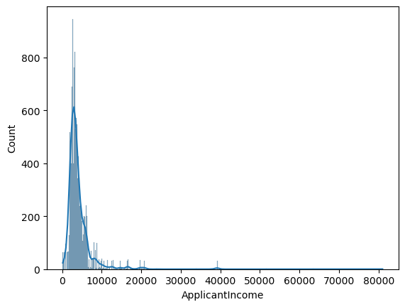

```python
# Importing libraries

import pandas as pd 
import numpy as np
import matplotlib.pyplot as plt
import seaborn as sns
from scipy.stats import f_oneway
from sklearn.impute import SimpleImputer
from sklearn.preprocessing import OneHotEncoder
from sklearn.compose import ColumnTransformer
```


```python
df_loan = pd.read_csv('loan_prediction-II.csv', sep = ';')

# Podríamos agregar un campo numérico de la variable dependiente. Pero se va a reemplazar mas adelante
# df_loan['Loan_Status_Numerical'] = pd.factorize(df_loan['Loan_Status'])[0]

# Podríamos limpiar el dataset quitando los registros que tengan valores nulos. Pero lo haremos mas adelante con la imputación.
#df_loan.dropna(inplace = True)
df_loan
```

<div>
<table border="1" class="dataframe">
  <thead>
    <tr style="text-align: right;">
      <th></th>
      <th>Loan_ID</th>
      <th>Gender</th>
      <th>Married</th>
      <th>Dependents</th>
      <th>Education</th>
      <th>Self_Employed</th>
      <th>ApplicantIncome</th>
      <th>CoapplicantIncome</th>
      <th>LoanAmount</th>
      <th>Loan_Amount_Term</th>
      <th>Credit_History</th>
      <th>Property_Area</th>
      <th>Nacionality</th>
      <th>Loan_Status</th>
    </tr>
  </thead>
  <tbody>
    <tr>
      <th>0</th>
      <td>LP001001</td>
      <td>Male</td>
      <td>Yes</td>
      <td>1</td>
      <td>Graduate</td>
      <td>No</td>
      <td>4583</td>
      <td>1508</td>
      <td>128.0</td>
      <td>360.0</td>
      <td>1.0</td>
      <td>Rural</td>
      <td>F</td>
      <td>N</td>
    </tr>
    <tr>
      <th>1</th>
      <td>LP001002</td>
      <td>Male</td>
      <td>Yes</td>
      <td>0</td>
      <td>Not Graduate</td>
      <td>No</td>
      <td>2583</td>
      <td>2358</td>
      <td>120.0</td>
      <td>360.0</td>
      <td>1.0</td>
      <td>Urban</td>
      <td>N</td>
      <td>Y</td>
    </tr>
    <tr>
      <th>2</th>
      <td>LP001003</td>
      <td>Male</td>
      <td>Yes</td>
      <td>2</td>
      <td>Graduate</td>
      <td>Yes</td>
      <td>5417</td>
      <td>4196</td>
      <td>267.0</td>
      <td>360.0</td>
      <td>1.0</td>
      <td>Urban</td>
      <td>N</td>
      <td>Y</td>
    </tr>
    <tr>
      <th>3</th>
      <td>LP001004</td>
      <td>Male</td>
      <td>Yes</td>
      <td>0</td>
      <td>Not Graduate</td>
      <td>No</td>
      <td>2333</td>
      <td>1516</td>
      <td>95.0</td>
      <td>360.0</td>
      <td>1.0</td>
      <td>Urban</td>
      <td>N</td>
      <td>Y</td>
    </tr>
    <tr>
      <th>4</th>
      <td>LP001005</td>
      <td>Male</td>
      <td>Yes</td>
      <td>3+</td>
      <td>Graduate</td>
      <td>No</td>
      <td>3036</td>
      <td>2504</td>
      <td>158.0</td>
      <td>360.0</td>
      <td>0.0</td>
      <td>Semiurban</td>
      <td>N</td>
      <td>N</td>
    </tr>
    <tr>
      <th>...</th>
      <td>...</td>
      <td>...</td>
      <td>...</td>
      <td>...</td>
      <td>...</td>
      <td>...</td>
      <td>...</td>
      <td>...</td>
      <td>...</td>
      <td>...</td>
      <td>...</td>
      <td>...</td>
      <td>...</td>
      <td>...</td>
    </tr>
    <tr>
      <th>11495</th>
      <td>LP012496</td>
      <td>Male</td>
      <td>No</td>
      <td>0</td>
      <td>Not Graduate</td>
      <td>No</td>
      <td>2346</td>
      <td>1600</td>
      <td>132.0</td>
      <td>360.0</td>
      <td>1.0</td>
      <td>Semiurban</td>
      <td>N</td>
      <td>Y</td>
    </tr>
    <tr>
      <th>11496</th>
      <td>LP012497</td>
      <td>Male</td>
      <td>Yes</td>
      <td>0</td>
      <td>Not Graduate</td>
      <td>No</td>
      <td>3010</td>
      <td>3136</td>
      <td>NaN</td>
      <td>360.0</td>
      <td>0.0</td>
      <td>Urban</td>
      <td>N</td>
      <td>N</td>
    </tr>
    <tr>
      <th>11497</th>
      <td>LP012498</td>
      <td>Male</td>
      <td>Yes</td>
      <td>0</td>
      <td>Graduate</td>
      <td>No</td>
      <td>2333</td>
      <td>2417</td>
      <td>136.0</td>
      <td>360.0</td>
      <td>1.0</td>
      <td>Urban</td>
      <td>N</td>
      <td>Y</td>
    </tr>
    <tr>
      <th>11498</th>
      <td>LP012499</td>
      <td>Male</td>
      <td>Yes</td>
      <td>0</td>
      <td>Graduate</td>
      <td>No</td>
      <td>2583</td>
      <td>2115</td>
      <td>120.0</td>
      <td>360.0</td>
      <td>NaN</td>
      <td>Urban</td>
      <td>N</td>
      <td>Y</td>
    </tr>
    <tr>
      <th>11499</th>
      <td>LP012500</td>
      <td>Male</td>
      <td>Yes</td>
      <td>2</td>
      <td>Not Graduate</td>
      <td>No</td>
      <td>1993</td>
      <td>1625</td>
      <td>113.0</td>
      <td>180.0</td>
      <td>1.0</td>
      <td>Semiurban</td>
      <td>N</td>
      <td>Y</td>
    </tr>
  </tbody>
</table>
<p>11500 rows × 14 columns</p>
</div>


```python
df_loan = df_loan.rename(columns = {'Nacionality': 'Nationality'})
```

### Pregunta Nº 1: 

> **_Definir el problema de la naturaleza que se tiene a continuación, además de los objetivos de negocio bien definidos_**

El problema identificado es la demora en la evaluación de la calificación de un crédito personal a un cliente de la entidad financiera. Por lo cual, la empresa se ve en la necesidad de implenentar un modelo en base a sus datos históricos, si el cliente solicitante califica o no a la solicitud de crédito.

-----------------------------------------------------------------------

### Pregunta Nº 2

> **_¿Qué tipo de variables se utilizan en el problema de negocio?_**

Las variables utilizadas en este dataset son:

- Categóricos Nominales
- Cuantitativas Discretas
- Cuantitativas Continuas


```python
df_loan.describe()
```

<div>
<table border="1" class="dataframe">
  <thead>
    <tr style="text-align: right;">
      <th></th>
      <th>ApplicantIncome</th>
      <th>CoapplicantIncome</th>
      <th>LoanAmount</th>
      <th>Loan_Amount_Term</th>
      <th>Credit_History</th>
    </tr>
  </thead>
  <tbody>
    <tr>
      <th>count</th>
      <td>11500.000000</td>
      <td>11500.000000</td>
      <td>11153.00000</td>
      <td>11203.000000</td>
      <td>10467.000000</td>
    </tr>
    <tr>
      <th>mean</th>
      <td>4125.334522</td>
      <td>2801.438000</td>
      <td>147.42446</td>
      <td>343.012764</td>
      <td>0.844846</td>
    </tr>
    <tr>
      <th>std</th>
      <td>3544.016291</td>
      <td>3437.119058</td>
      <td>71.32364</td>
      <td>63.589163</td>
      <td>0.362069</td>
    </tr>
    <tr>
      <th>min</th>
      <td>150.000000</td>
      <td>0.000000</td>
      <td>9.00000</td>
      <td>12.000000</td>
      <td>0.000000</td>
    </tr>
    <tr>
      <th>25%</th>
      <td>2544.000000</td>
      <td>1587.000000</td>
      <td>108.00000</td>
      <td>360.000000</td>
      <td>1.000000</td>
    </tr>
    <tr>
      <th>50%</th>
      <td>3316.000000</td>
      <td>2100.000000</td>
      <td>131.00000</td>
      <td>360.000000</td>
      <td>1.000000</td>
    </tr>
    <tr>
      <th>75%</th>
      <td>4583.000000</td>
      <td>3150.000000</td>
      <td>170.00000</td>
      <td>360.000000</td>
      <td>1.000000</td>
    </tr>
    <tr>
      <th>max</th>
      <td>81000.000000</td>
      <td>41682.000000</td>
      <td>700.00000</td>
      <td>480.000000</td>
      <td>1.000000</td>
    </tr>
  </tbody>
</table>
</div>


----------------------------------------------------------------------- 

### Pregunta Nº 3

> **_Realizar un informe sobre las principales medidas de tendencia central y de dispersión. Cuál de los estados de préstamo presenta mayor homogeneidad respecto a su ingreso como dependiente_**

El dataset presenta datos outliers, pues considero que una persona tenga un sueldo de 150


```python
df_loan['ApplicantIncome'].describe()
```


    count    11500.000000
    mean      4125.334522
    std       3544.016291
    min        150.000000
    25%       2544.000000
    50%       3316.000000
    75%       4583.000000
    max      81000.000000
    Name: ApplicantIncome, dtype: float64


```python
sns.histplot(df_loan.ApplicantIncome, kde = True)
plt.show()
```


    

    


```python
print("Asimetria: %f" %  df_loan['ApplicantIncome'].skew())
print("Kurtosis: %f" %  df_loan['ApplicantIncome'].kurt())
```

    Asimetria: 6.841534
    Kurtosis: 82.517867


> **Valor de asimetría positivo. Se valida en la cresta del histplot.**

> **Kurtosis leptokurtica, pues el valor de kurtosis es > 0. Se valida en el gráfico de Histplot**


```python
df_loan['CoapplicantIncome'].describe()
```


    count    11500.000000
    mean      2801.438000
    std       3437.119058
    min          0.000000
    25%       1587.000000
    50%       2100.000000
    75%       3150.000000
    max      41682.000000
    Name: CoapplicantIncome, dtype: float64


```python
sns.histplot(df_loan.CoapplicantIncome, kde = True)
plt.show()
```


    

    


```python
print("Asimetria: %f" %  df_loan['CoapplicantIncome'].skew())
print("Kurtosis: %f" %  df_loan['CoapplicantIncome'].kurt())
```

    Asimetria: 7.291188
    Kurtosis: 68.958586


> **Valor de asimetría positivo. Se valida en la cresta del histplot**

> **Kurtosis leptokurtica, pues el valor de kurtosis es > 0. Se valida en el gráfico de Histplot**


```python
sns.boxplot(data=df_loan, y = "ApplicantIncome", x = "Loan_Status")
plt.show()
```


    

    


Se puede inferir según el gráfico de boxplot, que el valor del **ApplicantIncome** no es la única variable directa para la toma de decisión si un cliente se le brinda el crédito o no. De no ser así, todas las personas que ganen mas del máximo, obtendrían el préstamo.

----------------------------------------

## Pregunta Nº 4

>   Evaluar la completitud de los datos, sacando indicadores para los datos antes de la imputación y después. Comente sus resultados. (Imputación datos)

Validamos los valores nulos y que deberán ser imputados


```python
df_loan.isnull().sum()
```


    Loan_ID                 0
    Gender                236
    Married                36
    Dependents            241
    Education               0
    Self_Employed         641
    ApplicantIncome         0
    CoapplicantIncome       0
    LoanAmount            347
    Loan_Amount_Term      297
    Credit_History       1033
    Property_Area           0
    Nationality             0
    Loan_Status             0
    dtype: int64


Se debería aplicar estrategias **"mean"** para variables numéricas y **"most_frequent"** para variables categóricas.


```python
# Creamos las variables imputer

imputerNumerical = SimpleImputer(missing_values = np.nan, strategy = 'mean') 
imputerCategorical = SimpleImputer(missing_values = np.nan, strategy = 'most_frequent') 
```


```python
# Realizamos la imputación al dataset

imputerNumerical.fit(df_loan.loc[:,['LoanAmount']])
imputerCategorical.fit(df_loan.loc[:,['Gender','Married','Dependents','Self_Employed','Loan_Amount_Term','Credit_History']])

newDf = pd.DataFrame(imputerNumerical.transform(df_loan.loc[:,['LoanAmount']]),columns=['LoanAmount'])
newDf = pd.DataFrame(imputerCategorical.transform(df_loan.loc[:,['Gender','Married','Dependents','Self_Employed','Loan_Amount_Term','Credit_History']]),columns=['Gender','Married','Dependents','Self_Employed','Loan_Amount_Term','Credit_History'])
```

Validamos que ya no se tienen valores nulos


```python
newDf.isnull().sum()
```


    Gender              0
    Married             0
    Dependents          0
    Self_Employed       0
    Loan_Amount_Term    0
    Credit_History      0
    dtype: int64


Agregamos las columnas restantes al nuevo dataframe


```python
# newDf['Loan_ID'] = df_loan['Loan_ID']
newDf['Education'] = df_loan['Education']
newDf['ApplicantIncome'] = df_loan['ApplicantIncome']
newDf['CoapplicantIncome'] = df_loan['CoapplicantIncome']
newDf['Property_Area'] = df_loan['Property_Area']
newDf['Nationality'] = df_loan['Nationality']
#newDf['LoanAmount'] = df_loan['LoanAmount']
newDf['Loan_Status'] = df_loan['Loan_Status']
```

Se tiene datos que pueden ser reemplazados por valores binarios (Loan_Status, Nationality, Education, Gender, etc)


```python
newDf.head()
```

<div>
<table border="1" class="dataframe">
  <thead>
    <tr style="text-align: right;">
      <th></th>
      <th>Gender</th>
      <th>Married</th>
      <th>Dependents</th>
      <th>Self_Employed</th>
      <th>Loan_Amount_Term</th>
      <th>Credit_History</th>
      <th>Education</th>
      <th>ApplicantIncome</th>
      <th>CoapplicantIncome</th>
      <th>Property_Area</th>
      <th>Nationality</th>
      <th>Loan_Status</th>
    </tr>
  </thead>
  <tbody>
    <tr>
      <th>0</th>
      <td>Male</td>
      <td>Yes</td>
      <td>1</td>
      <td>No</td>
      <td>360.0</td>
      <td>1.0</td>
      <td>Graduate</td>
      <td>4583</td>
      <td>1508</td>
      <td>Rural</td>
      <td>F</td>
      <td>N</td>
    </tr>
    <tr>
      <th>1</th>
      <td>Male</td>
      <td>Yes</td>
      <td>0</td>
      <td>No</td>
      <td>360.0</td>
      <td>1.0</td>
      <td>Not Graduate</td>
      <td>2583</td>
      <td>2358</td>
      <td>Urban</td>
      <td>N</td>
      <td>Y</td>
    </tr>
    <tr>
      <th>2</th>
      <td>Male</td>
      <td>Yes</td>
      <td>2</td>
      <td>Yes</td>
      <td>360.0</td>
      <td>1.0</td>
      <td>Graduate</td>
      <td>5417</td>
      <td>4196</td>
      <td>Urban</td>
      <td>N</td>
      <td>Y</td>
    </tr>
    <tr>
      <th>3</th>
      <td>Male</td>
      <td>Yes</td>
      <td>0</td>
      <td>No</td>
      <td>360.0</td>
      <td>1.0</td>
      <td>Not Graduate</td>
      <td>2333</td>
      <td>1516</td>
      <td>Urban</td>
      <td>N</td>
      <td>Y</td>
    </tr>
    <tr>
      <th>4</th>
      <td>Male</td>
      <td>Yes</td>
      <td>3+</td>
      <td>No</td>
      <td>360.0</td>
      <td>0.0</td>
      <td>Graduate</td>
      <td>3036</td>
      <td>2504</td>
      <td>Semiurban</td>
      <td>N</td>
      <td>N</td>
    </tr>
  </tbody>
</table>
</div>


```python
print(newDf.Nationality.unique()) # Foreign (F) and National (N)
print(newDf.Loan_Status.unique()) # No (N) and Yes (Y)
print(newDf.Education.unique()) # Graduate and Not Graduate
print(newDf.Gender.unique()) # Male and Female
print(newDf.Self_Employed.unique()) # No and Yes
print(newDf.Married.unique()) # No and Yes
print(newDf.Property_Area.unique()) # Rural, Urban and Semiurban
print(newDf.Dependents.unique()) # Dependientes
```

    ['F' 'N']
    ['N' 'Y']
    ['Graduate' 'Not Graduate']
    ['Male' 'Female']
    ['No' 'Yes']
    ['Yes' 'No']
    ['Rural' 'Urban' 'Semiurban']
    ['1' '0' '2' '3+']


```python
# Creamos los diccionarios para reemplazar los valores

dicNationality = {'F': 1, 'N': 0}
dicLoanStatus = {'Y': 1, 'N': 0}
dicEducation = {'Graduate': 1, 'Not Graduate': 0}
dicGender = {'Male': 0, 'Female': 1}
dicSelfEmployed = {'No': 0, 'Yes': 1}
dicMarried = {'No': 0, 'Yes': 1}
dicPropertyArea = {'Rural': 0, 'Semiurban': 1, 'Urban': 2 }
dicDependents = {'0': 0, '1': 1, '2': 2, '3+': 3 }
```


```python
# Aplicamos los cambios

newDf = newDf.replace({'Nationality': dicNationality, 
                            'Loan_Status': dicLoanStatus,
                            'Education': dicEducation,
                            'Gender': dicGender,
                            'Self_Employed': dicSelfEmployed,
                            'Married': dicMarried,
                            'Property_Area': dicPropertyArea,
                            'Dependents': dicDependents})
```


```python
newDf.head()
```


<div>
<table border="1" class="dataframe">
  <thead>
    <tr style="text-align: right;">
      <th></th>
      <th>Gender</th>
      <th>Married</th>
      <th>Dependents</th>
      <th>Self_Employed</th>
      <th>Loan_Amount_Term</th>
      <th>Credit_History</th>
      <th>Education</th>
      <th>ApplicantIncome</th>
      <th>CoapplicantIncome</th>
      <th>Property_Area</th>
      <th>Nationality</th>
      <th>Loan_Status</th>
    </tr>
  </thead>
  <tbody>
    <tr>
      <th>0</th>
      <td>0</td>
      <td>1</td>
      <td>1</td>
      <td>0</td>
      <td>360.0</td>
      <td>1.0</td>
      <td>1</td>
      <td>4583</td>
      <td>1508</td>
      <td>0</td>
      <td>1</td>
      <td>0</td>
    </tr>
    <tr>
      <th>1</th>
      <td>0</td>
      <td>1</td>
      <td>0</td>
      <td>0</td>
      <td>360.0</td>
      <td>1.0</td>
      <td>0</td>
      <td>2583</td>
      <td>2358</td>
      <td>2</td>
      <td>0</td>
      <td>1</td>
    </tr>
    <tr>
      <th>2</th>
      <td>0</td>
      <td>1</td>
      <td>2</td>
      <td>1</td>
      <td>360.0</td>
      <td>1.0</td>
      <td>1</td>
      <td>5417</td>
      <td>4196</td>
      <td>2</td>
      <td>0</td>
      <td>1</td>
    </tr>
    <tr>
      <th>3</th>
      <td>0</td>
      <td>1</td>
      <td>0</td>
      <td>0</td>
      <td>360.0</td>
      <td>1.0</td>
      <td>0</td>
      <td>2333</td>
      <td>1516</td>
      <td>2</td>
      <td>0</td>
      <td>1</td>
    </tr>
    <tr>
      <th>4</th>
      <td>0</td>
      <td>1</td>
      <td>3</td>
      <td>0</td>
      <td>360.0</td>
      <td>0.0</td>
      <td>1</td>
      <td>3036</td>
      <td>2504</td>
      <td>1</td>
      <td>0</td>
      <td>0</td>
    </tr>
  </tbody>
</table>
</div>


## Pregunta Nº 5

>  Evaluar los outliers o casos atípicos univariados para las variables cuantitativas. Muestre los principales gráficos para identificarlos y muéstrelos


```python
# Analisis univariado para ApplicantIncome

plt.boxplot(newDf.ApplicantIncome)
plt.show()
```


    

    


> **Existe valores atípicos (outliers) dentro del dataset.** Por lo que no deberían ser considerados dentro del proceso de entrenamiento del modelo.


```python
# Analisis univariado para CoapplicantIncome

plt.boxplot(newDf.CoapplicantIncome)
plt.show()
```


    

    


> **Existe valores atípicos dentro del dataset.**> **Existe valores atípicos (outliers) dentro del dataset.** Por lo que no deberían ser considerados dentro del proceso de entrenamiento del modelo.

-------------------------------

## Pregunta Nº 6

>  Evaluar la colinealidad o multicolinealidad en las variables, identificando aquellas en las cuáles su coeficiente de asociación supere el punto de corte de +-0.3.


```python
# Matriz de correlación:
plt.figure(figsize=(12,9))
corrmat = newDf.corr()
sns.heatmap(corrmat, vmax = .08, square = True, annot = True,);
plt.show()
```


    

    


> Se valida que existe multicolinealidad moderada entre las variables independientes **LoanAmount** vs **ApplicantIncome** y la **LoanAmount y CoapplicantIncome**

---------------------------------

## Pregunta Nº 7

>  Desarrolle las mejores transformaciones de variables para las variables cuantitativas, fundamente el porqué de las transformaciones y muestre los hallazgos más relevantes


```python
# Convertimos las variables categoricas como ordinarias nominales

ct = ColumnTransformer([('one_hot_encoder', OneHotEncoder(categories='auto'), ['Property_Area', 'Dependents'])],remainder='passthrough')
oneHotDf = pd.DataFrame(np.array(ct.fit_transform(newDf), dtype = np.int))
```


```python
oneHotDf.head()
```


<div>
<table border="1" class="dataframe">
  <thead>
    <tr style="text-align: right;">
      <th></th>
      <th>0</th>
      <th>1</th>
      <th>2</th>
      <th>3</th>
      <th>4</th>
      <th>5</th>
      <th>6</th>
      <th>7</th>
      <th>8</th>
      <th>9</th>
      <th>10</th>
      <th>11</th>
      <th>12</th>
      <th>13</th>
      <th>14</th>
      <th>15</th>
      <th>16</th>
    </tr>
  </thead>
  <tbody>
    <tr>
      <th>0</th>
      <td>1</td>
      <td>0</td>
      <td>0</td>
      <td>0</td>
      <td>1</td>
      <td>0</td>
      <td>0</td>
      <td>0</td>
      <td>1</td>
      <td>0</td>
      <td>360</td>
      <td>1</td>
      <td>1</td>
      <td>4583</td>
      <td>1508</td>
      <td>1</td>
      <td>0</td>
    </tr>
    <tr>
      <th>1</th>
      <td>0</td>
      <td>0</td>
      <td>1</td>
      <td>1</td>
      <td>0</td>
      <td>0</td>
      <td>0</td>
      <td>0</td>
      <td>1</td>
      <td>0</td>
      <td>360</td>
      <td>1</td>
      <td>0</td>
      <td>2583</td>
      <td>2358</td>
      <td>0</td>
      <td>1</td>
    </tr>
    <tr>
      <th>2</th>
      <td>0</td>
      <td>0</td>
      <td>1</td>
      <td>0</td>
      <td>0</td>
      <td>1</td>
      <td>0</td>
      <td>0</td>
      <td>1</td>
      <td>1</td>
      <td>360</td>
      <td>1</td>
      <td>1</td>
      <td>5417</td>
      <td>4196</td>
      <td>0</td>
      <td>1</td>
    </tr>
    <tr>
      <th>3</th>
      <td>0</td>
      <td>0</td>
      <td>1</td>
      <td>1</td>
      <td>0</td>
      <td>0</td>
      <td>0</td>
      <td>0</td>
      <td>1</td>
      <td>0</td>
      <td>360</td>
      <td>1</td>
      <td>0</td>
      <td>2333</td>
      <td>1516</td>
      <td>0</td>
      <td>1</td>
    </tr>
    <tr>
      <th>4</th>
      <td>0</td>
      <td>1</td>
      <td>0</td>
      <td>0</td>
      <td>0</td>
      <td>0</td>
      <td>1</td>
      <td>0</td>
      <td>1</td>
      <td>0</td>
      <td>360</td>
      <td>0</td>
      <td>1</td>
      <td>3036</td>
      <td>2504</td>
      <td>0</td>
      <td>0</td>
    </tr>
  </tbody>
</table>
</div>


Las variables **Property_Area** y **Dependents** han sido transformados a variable numéricas. Pero debemos quitarle ordinalidad configurándolo como nominal.

---------------------------------

## Pregunta Nº 8

>  Realice un análisis de asociación de la variable dependiente respecto a alguna variable cualitativa y otra cuantitativa. Comentes sus resultados.


```python
fig, ax = plt.subplots(figsize=(6, 3.84))

sns.violinplot(
        x     = 'Loan_Status',
        y     = 'ApplicantIncome',
        data  = newDf,
        ax    = ax
    )

ax.set_title('Distribución de crédito por sueldo dependiente');
plt.show()
```


    

    


```python
# Obtenemos el valor de correlación entre la variable dependiente (categórica) y la variable independiente (numérica)

filterList = newDf.groupby('Loan_Status')['ApplicantIncome'].apply(list)
correlationResult = f_oneway(*filterList)
print('Valor de correlación entre Loan Status y ApplicationIncome: ', correlationResult[1])
```

    Valor de correlación entre Loan Status y ApplicationIncome:  9.851641839808747e-05


Se valida visualmente y mediante el método f_oneway, que no existe una correlación entre las variables Loan_Status y ApplicantIncome.


```python
fig, ax = plt.subplots(figsize=(6, 3.84))

sns.violinplot(
        x     = 'Loan_Status',
        y     = 'Married',
        data  = newDf,
        ax    = ax
    )

ax.set_title('Distribución de crédito por estado civil');
plt.show()
```


    

    


```python
# Obtenemos el valor de correlación entre la variable dependiente (numérica) y la variable independiente (categórica)

filterList = newDf.groupby('Married')['Loan_Status'].apply(list)
correlationResult = f_oneway(*filterList)
print('Valor de correlación entre Loan Status y ApplicationIncome: ', correlationResult[1])
```

    Valor de correlación entre Loan Status y ApplicationIncome:  1.207018745449486e-10


Se valida visualmente y mediante el método f_oneway, que no existe una correlación entre las variables Loan_Status y Married.
